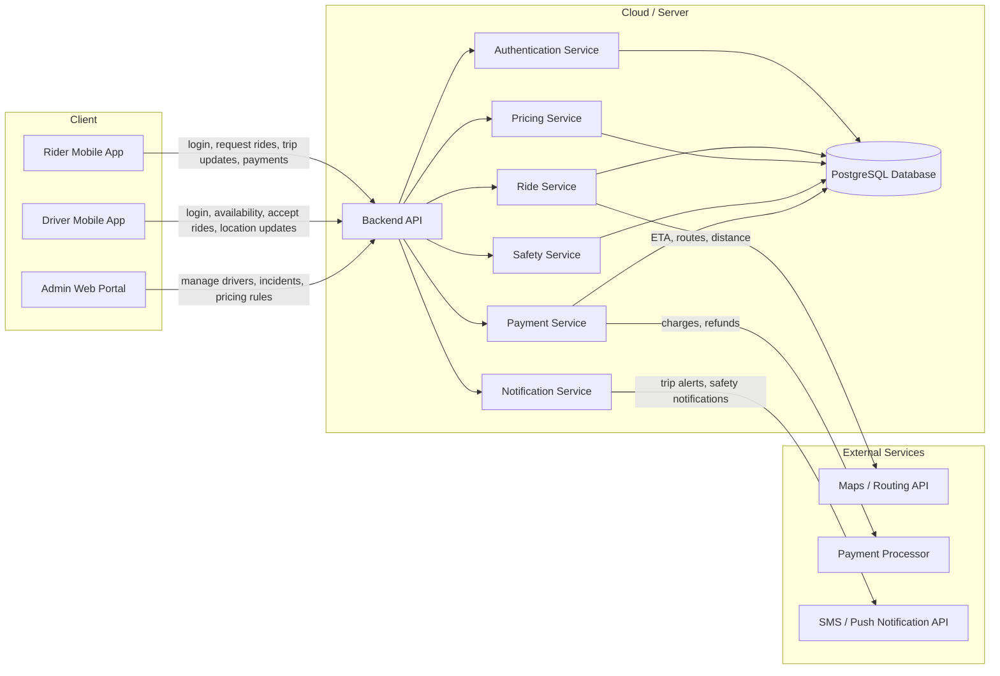

# Software Architecture — Ultra

## Architecture Diagram

## APIs

The APIs below are consistent with the components shown in the architecture diagram.

### Authentication API
- `POST /api/auth/register`
- `POST /api/auth/login`
- `POST /api/auth/logout`
- `GET /api/auth/me`

Used by:
- Rider Mobile App
- Driver Mobile App
- Admin Web Portal

Purpose:
- account creation
- login and logout
- session lookup

### Ride API
- `POST /api/rides`
- `GET /api/rides/{id}`
- `POST /api/rides/{id}/cancel`
- `POST /api/rides/{id}/start`
- `POST /api/rides/{id}/complete`

Used by:
- Rider Mobile App
- Driver Mobile App

Purpose:
- create and manage rides
- update ride state
- cancel rides

### Driver API
- `POST /api/drivers/status`
- `POST /api/drivers/location`
- `GET /api/drivers/requests`
- `POST /api/drivers/requests/{id}/accept`
- `POST /api/drivers/requests/{id}/reject`

Used by:
- Driver Mobile App

Purpose:
- update driver availability
- send live location
- accept or reject ride requests

### Pricing API
- `GET /api/pricing/estimate`
- `GET /api/pricing/packages`
- `POST /api/pricing/packages/subscribe`

Used by:
- Rider Mobile App
- Admin Web Portal

Purpose:
- show upfront pricing
- support commuter package subscriptions
- manage predictable pricing options

### Safety API
- `POST /api/safety/pin/verify`
- `POST /api/safety/report`
- `GET /api/safety/trip-share/{rideId}`
- `POST /api/drivers/favorite/{driverId}`

Used by:
- Rider Mobile App
- Driver Mobile App
- Admin Web Portal

Purpose:
- verify rider and driver match with ride PIN
- report incidents
- share trip details with trusted contacts
- save preferred drivers

### Admin API
- `GET /api/admin/rides`
- `GET /api/admin/drivers`
- `GET /api/admin/incidents`
- `PATCH /api/admin/drivers/{id}/status`
- `PATCH /api/admin/pricing-rules/{id}`

Used by:
- Admin Web Portal

Purpose:
- review rides, drivers, and incidents
- manage driver status
- update pricing rules

## AI Chat Transcripts

The following AI-assisted transcripts informed this architecture design and are linked here in the repository:

- [Cassie Coleman Interview](./p1-part1-user_discovery_interview-cassie_coleman.md)
- [Derron Dowdy Interview](./p1-part1-user_discovery_interview-derron_dowdy.md)
- [Jacob Moore Interview](./p1-part1-user_discovery_interview-jacob_moore.md)

### Cross-reference to design decisions

- The focus on **predictable pricing** and **commuter packages** came directly from repeated interview feedback in the Cassie, Derron, and Jacob transcripts.
- The **Safety API** and preferred-driver support came from recurring concerns about trusted drivers, ride verification, and trip sharing in the interview transcripts.
- The **Ride API** and **Driver API** reflect the need for reliable ride requests, driver availability updates, and better rider experience during rush hour.
- The inclusion of pricing packages in the architecture aligns with the product direction described in the user discovery summary and storyboard materials.
