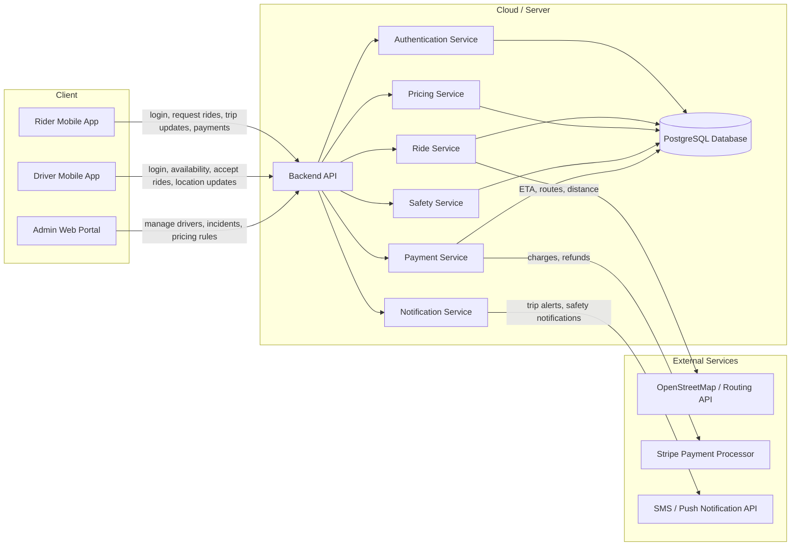

# Software Architecture — Ultra

## Architecture Diagram

## APIs

The APIs below are consistent with the components shown in the architecture diagram.

### Authentication API
- `POST /api/auth/register`
- `POST /api/auth/login`
- `POST /api/auth/logout`
- `GET /api/auth/me`

Used by:
- Rider Mobile App
- Driver Mobile App
- Admin Web Portal

Purpose:
- account creation
- login and logout
- session lookup

### Ride API
- `POST /api/rides`
- `GET /api/rides/{id}`
- `POST /api/rides/{id}/cancel`
- `POST /api/rides/{id}/start`
- `POST /api/rides/{id}/complete`

Used by:
- Rider Mobile App
- Driver Mobile App

Purpose:
- create and manage rides
- update ride state
- cancel rides

### Driver API
- `POST /api/drivers/status`
- `POST /api/drivers/location`
- `GET /api/drivers/requests`
- `POST /api/drivers/requests/{id}/accept`
- `POST /api/drivers/requests/{id}/reject`

Used by:
- Driver Mobile App

Purpose:
- update driver availability
- send live location
- accept or reject ride requests

### Pricing API
- `GET /api/pricing/estimate`
- `GET /api/pricing/packages`
- `POST /api/pricing/packages/subscribe`

Used by:
- Rider Mobile App
- Admin Web Portal

Purpose:
- show upfront pricing
- support commuter package subscriptions
- manage predictable pricing options

### Payment API
- `POST /api/payment/create-session`
- `GET /api/payment/verify`

Used by:
- Rider Mobile App
- Admin Web Portal

Purpose:
- create Stripe Checkout sessions for subscription and ride payments
- verify payment session status after user returns from Stripe hosted form
- handle payment records and Stripe webhook events

Details:

**POST /api/payment/create-session**
- Creates a Stripe Checkout Session for payment processing
- Request: `{ amount: number (cents), currency: string, description: string, subscription_id?: string, ride_id?: string }`
- Response: `{ session_id: string, checkout_url: string }`

**GET /api/payment/verify?session_id={stripe_session_id}**
- Verifies payment status after user returns from Stripe hosted form
- Response: `{ status: "succeeded" | "failed", payment_id: string, amount: number, currency: string }`

**Note**: All card payment processing occurs on Stripe's domain. Frontend never handles raw card data. Backend processes Stripe webhooks (payment_intent.succeeded, charge.failed) asynchronously.

### Safety API
- `POST /api/safety/pin/verify`
- `POST /api/safety/report`
- `GET /api/safety/trip-share/{rideId}`
- `POST /api/drivers/favorite/{driverId}`

Used by:
- Rider Mobile App
- Driver Mobile App
- Admin Web Portal

Purpose:
- verify rider and driver match with ride PIN
- report incidents
- share trip details with trusted contacts
- save preferred drivers

### Admin API
- `GET /api/admin/rides`
- `GET /api/admin/drivers`
- `GET /api/admin/incidents`
- `PATCH /api/admin/drivers/{id}/status`
- `PATCH /api/admin/pricing-rules/{id}`

Used by:
- Admin Web Portal

Purpose:
- review rides, drivers, and incidents
- manage driver status
- update pricing rules

## External Services Integration

### Maps & Routing API
**Service**: OpenStreetMap + Leaflet
- Backend uses OpenStreetMap for tile generation and geocoding
- Routing calculations provided via OSM or OSRM (Open Source Routing Machine)
- Frontend renders maps using `react-leaflet` with OpenStreetMap tiles
- No API key required; community-maintained and free

### Payment Processor
**Service**: Stripe
- Stripe Checkout: Hosted payment form for collection (PCI DSS compliant)
- Backend integration: Creates CheckoutSession, handles webhooks for payment events
- Frontend redirect pattern: Users redirected to Stripe domain for secure card entry
- No sensitive card data stored on Ultra servers; Stripe handles all compliance
- Supports 3D Secure and advanced fraud detection

### Messaging API
**Service**: To be determined (recommended: Twilio or similar)
- SMS notifications for critical user events (ride confirmation, driver arrival, trip completion)
- Push notifications for real-time updates (future: Firebase Cloud Messaging)
- Handled entirely by backend NotificationService

## AI Chat Transcripts

The following AI-assisted transcripts informed this architecture design and are linked here in the repository:

- [Cassie Coleman Interview](./p1-part1-user_discovery_interview-cassie_coleman.md)
- [Derron Dowdy Interview](./p1-part1-user_discovery_interview-derron_dowdy.md)
- [Jacob Moore Interview](./p1-part1-user_discovery_interview-jacob_moore.md)

### Cross-reference to design decisions

- The focus on **predictable pricing** and **commuter packages** came directly from repeated interview feedback in the Cassie, Derron, and Jacob transcripts.
- The **Safety API** and preferred-driver support came from recurring concerns about trusted drivers, ride verification, and trip sharing in the interview transcripts.
- The **Ride API** and **Driver API** reflect the need for reliable ride requests, driver availability updates, and better rider experience during rush hour.
- The inclusion of pricing packages in the architecture aligns with the product direction described in the user discovery summary and storyboard materials.
