# Ultra Database Schema — Fully Normalized (Option A)

## Entity-Relationship Diagram

```mermaid
erDiagram
    %% ============================================================
    %% AUTH & IDENTITY
    %% ============================================================

    AUTH_USERS {
        uuid id PK "Supabase-managed"
        text email UK "NOT NULL"
        text encrypted_password "NOT NULL"
        timestamptz email_confirmed_at
        timestamptz last_sign_in_at
        jsonb raw_app_meta_data
        jsonb raw_user_meta_data
        timestamptz created_at "NOT NULL DEFAULT now()"
        timestamptz updated_at "NOT NULL DEFAULT now()"
    }

    USER_ROLES {
        uuid id PK "DEFAULT gen_random_uuid()"
        uuid user_id FK "NOT NULL, UNIQUE"
        text role "CHECK (rider|driver|admin)"
        uuid created_by FK "user who assigned role"
        uuid updated_by FK "user who last changed role"
        timestamptz created_at "NOT NULL DEFAULT now()"
        timestamptz updated_at "NOT NULL DEFAULT now()"
        timestamptz deleted_at "soft delete"
        int version "optimistic lock DEFAULT 1"
    }

    RIDERS {
        uuid id PK "DEFAULT gen_random_uuid()"
        uuid user_id FK "NOT NULL, UNIQUE"
        text name "NOT NULL"
        text phone
        text avatar_url
        uuid created_by FK
        uuid updated_by FK
        timestamptz created_at "NOT NULL DEFAULT now()"
        timestamptz updated_at "NOT NULL DEFAULT now()"
        timestamptz deleted_at "soft delete"
        int version "optimistic lock DEFAULT 1"
    }

    RIDER_PROFILES {
        uuid id PK "DEFAULT gen_random_uuid()"
        uuid rider_id FK "NOT NULL"
        text name "NOT NULL"
        text photo_url
        boolean is_child "NOT NULL DEFAULT false"
        text notes "optional special instructions"
        uuid created_by FK
        uuid updated_by FK
        timestamptz created_at "NOT NULL DEFAULT now()"
        timestamptz updated_at "NOT NULL DEFAULT now()"
        timestamptz deleted_at "soft delete"
        int version "optimistic lock DEFAULT 1"
    }

    EMERGENCY_CONTACTS {
        uuid id PK "DEFAULT gen_random_uuid()"
        uuid rider_profile_id FK "NOT NULL"
        text name "NOT NULL"
        text phone "NOT NULL"
        text relationship "e.g. mother, father, guardian"
        boolean is_primary "DEFAULT false"
        uuid created_by FK
        uuid updated_by FK
        timestamptz created_at "NOT NULL DEFAULT now()"
        timestamptz updated_at "NOT NULL DEFAULT now()"
        timestamptz deleted_at "soft delete"
    }

    NOTIFICATION_PREFERENCES {
        uuid id PK "DEFAULT gen_random_uuid()"
        uuid user_id FK "NOT NULL, UNIQUE"
        boolean sms_enabled "NOT NULL DEFAULT true"
        boolean push_enabled "NOT NULL DEFAULT true"
        boolean email_enabled "NOT NULL DEFAULT true"
        uuid updated_by FK
        timestamptz created_at "NOT NULL DEFAULT now()"
        timestamptz updated_at "NOT NULL DEFAULT now()"
    }

    %% ============================================================
    %% DRIVERS
    %% ============================================================

    DRIVERS {
        uuid id PK "DEFAULT gen_random_uuid()"
        uuid user_id FK "NOT NULL, UNIQUE"
        text name "NOT NULL"
        text phone
        text avatar_url
        text vehicle_make
        text vehicle_model
        int vehicle_year
        text vehicle_color
        text license_plate "UNIQUE"
        boolean is_child_safe "NOT NULL DEFAULT false"
        numeric_3_2 rating "DEFAULT 5.00"
        int total_ratings "DEFAULT 0"
        text status "CHECK (offline|available|on_trip)"
        uuid created_by FK
        uuid updated_by FK
        timestamptz created_at "NOT NULL DEFAULT now()"
        timestamptz updated_at "NOT NULL DEFAULT now()"
        timestamptz deleted_at "soft delete"
        int version "optimistic lock DEFAULT 1"
    }

    DRIVER_SAFETY_CERTS {
        uuid id PK "DEFAULT gen_random_uuid()"
        uuid driver_id FK "NOT NULL"
        text cert_type "e.g. child_seat, first_aid, background_check"
        text cert_number "external certificate ID"
        text issuing_authority
        timestamptz verified_at
        timestamptz expires_at
        uuid verified_by FK "admin who verified"
        uuid created_by FK
        uuid updated_by FK
        timestamptz created_at "NOT NULL DEFAULT now()"
        timestamptz updated_at "NOT NULL DEFAULT now()"
        timestamptz deleted_at "soft delete"
    }

    DRIVER_LOCATIONS {
        uuid id PK "DEFAULT gen_random_uuid()"
        uuid driver_id FK "NOT NULL, UNIQUE"
        float8 lat "NOT NULL"
        float8 lng "NOT NULL"
        float8 heading "bearing in degrees"
        float8 speed_mph
        text source "gps|manual|simulated"
        timestamptz recorded_at "NOT NULL DEFAULT now()"
        timestamptz created_at "NOT NULL DEFAULT now()"
        timestamptz updated_at "NOT NULL DEFAULT now()"
    }

    %% ============================================================
    %% RIDES
    %% ============================================================

    RIDES {
        uuid id PK "DEFAULT gen_random_uuid()"
        uuid rider_id FK "NOT NULL"
        uuid rider_profile_id FK "optional child profile"
        uuid driver_id FK "NULL until matched"
        float8 pickup_lat "NOT NULL"
        float8 pickup_lng "NOT NULL"
        text pickup_address "NOT NULL"
        float8 dropoff_lat "NOT NULL"
        float8 dropoff_lng "NOT NULL"
        text dropoff_address "NOT NULL"
        text status "CHECK (requested|matching|driver_en_route|arrived|in_progress|completed|cancelled)"
        numeric_10_2 fare_estimate
        numeric_10_2 fare_final
        numeric_10_2 distance_miles
        int estimated_duration_min
        int actual_duration_min
        text cancel_reason
        uuid cancelled_by FK "user who cancelled"
        timestamptz scheduled_for "NULL = immediate"
        boolean is_recurring "NOT NULL DEFAULT false"
        text recurrence_rule "iCal RRULE format"
        boolean is_child_safe_required "NOT NULL DEFAULT false"
        boolean prefer_trusted_driver "NOT NULL DEFAULT false"
        text pin_hash "bcrypt/argon2 hash for child-ride pickup PIN"
        int pin_attempts "NOT NULL DEFAULT 0"
        timestamptz requested_at "NOT NULL DEFAULT now()"
        timestamptz matched_at
        timestamptz driver_arrived_at
        timestamptz pickup_at
        timestamptz completed_at
        timestamptz cancelled_at
        uuid created_by FK
        uuid updated_by FK
        timestamptz created_at "NOT NULL DEFAULT now()"
        timestamptz updated_at "NOT NULL DEFAULT now()"
        timestamptz deleted_at "soft delete"
        int version "optimistic lock DEFAULT 1"
    }

    RIDE_STOPS {
        uuid id PK "DEFAULT gen_random_uuid()"
        uuid ride_id FK "NOT NULL"
        int stop_order "NOT NULL, 0-indexed"
        float8 lat "NOT NULL"
        float8 lng "NOT NULL"
        text address "NOT NULL"
        text label "e.g. School, Daycare"
        timestamptz arrived_at
        timestamptz departed_at
        uuid created_by FK
        timestamptz created_at "NOT NULL DEFAULT now()"
        timestamptz updated_at "NOT NULL DEFAULT now()"
    }

    RIDE_STATUS_HISTORY {
        uuid id PK "DEFAULT gen_random_uuid()"
        uuid ride_id FK "NOT NULL"
        text from_status "previous status, NULL for initial"
        text to_status "NOT NULL"
        uuid changed_by FK "user or system"
        text change_reason "optional context"
        text change_source "CHECK (rider|driver|system|admin)"
        timestamptz changed_at "NOT NULL DEFAULT now()"
        timestamptz created_at "NOT NULL DEFAULT now()"
    }

    RIDE_RATINGS {
        uuid id PK "DEFAULT gen_random_uuid()"
        uuid ride_id FK "NOT NULL, UNIQUE"
        uuid rider_id FK "NOT NULL"
        uuid driver_id FK "NOT NULL"
        int rider_gave_driver "1-5 stars"
        int driver_gave_rider "1-5 stars"
        text rider_comment "max 500 chars"
        text driver_comment "max 500 chars"
        numeric_10_2 tip_amount "DEFAULT 0.00"
        boolean rider_submitted "DEFAULT false"
        boolean driver_submitted "DEFAULT false"
        uuid created_by FK
        uuid updated_by FK
        timestamptz created_at "NOT NULL DEFAULT now()"
        timestamptz updated_at "NOT NULL DEFAULT now()"
    }

    %% ============================================================
    %% PAYMENTS
    %% ============================================================

    PAYMENTS {
        uuid id PK "DEFAULT gen_random_uuid()"
        uuid ride_id FK "NOT NULL"
        uuid rider_id FK "NOT NULL"
        numeric_10_2 amount "NOT NULL"
        text currency "NOT NULL DEFAULT usd"
        text status "CHECK (pending|authorized|captured|refunded|failed)"
        text stripe_payment_intent_id
        text stripe_charge_id
        text payment_method "card|ride_pass|split"
        text failure_reason
        timestamptz authorized_at
        timestamptz captured_at
        timestamptz refunded_at
        timestamptz failed_at
        uuid created_by FK
        uuid updated_by FK
        timestamptz created_at "NOT NULL DEFAULT now()"
        timestamptz updated_at "NOT NULL DEFAULT now()"
        timestamptz deleted_at "soft delete"
        int version "optimistic lock DEFAULT 1"
    }

    RIDE_PASSES {
        uuid id PK "DEFAULT gen_random_uuid()"
        uuid rider_id FK "NOT NULL"
        text plan_name "NOT NULL"
        text plan_description
        int rides_total "NOT NULL"
        int rides_remaining "NOT NULL"
        numeric_10_2 price_paid "NOT NULL"
        text status "CHECK (active|expired|cancelled|exhausted)"
        text stripe_subscription_id
        timestamptz purchased_at "NOT NULL DEFAULT now()"
        timestamptz expires_at "NOT NULL"
        timestamptz cancelled_at
        text cancellation_reason
        uuid created_by FK
        uuid updated_by FK
        timestamptz created_at "NOT NULL DEFAULT now()"
        timestamptz updated_at "NOT NULL DEFAULT now()"
        timestamptz deleted_at "soft delete"
        int version "optimistic lock DEFAULT 1"
    }

    FARE_SPLITS {
        uuid id PK "DEFAULT gen_random_uuid()"
        uuid ride_id FK "NOT NULL"
        uuid inviter_id FK "NOT NULL (rider who initiated)"
        uuid invitee_id FK "NOT NULL (rider invited to split)"
        numeric_10_2 inviter_amount "NOT NULL"
        numeric_10_2 invitee_amount "NOT NULL"
        text status "CHECK (pending|accepted|declined|expired)"
        timestamptz responded_at
        timestamptz expires_at "auto-expire if not accepted"
        uuid created_by FK
        uuid updated_by FK
        timestamptz created_at "NOT NULL DEFAULT now()"
        timestamptz updated_at "NOT NULL DEFAULT now()"
    }

    %% ============================================================
    %% SAFETY & NOTIFICATIONS
    %% ============================================================

    TRUSTED_DRIVERS {
        uuid id PK "DEFAULT gen_random_uuid()"
        uuid rider_id FK "NOT NULL"
        uuid driver_id FK "NOT NULL"
        text nickname "rider's label for this driver"
        uuid created_by FK
        timestamptz created_at "NOT NULL DEFAULT now()"
        timestamptz updated_at "NOT NULL DEFAULT now()"
        timestamptz deleted_at "soft delete"
    }

    TRIP_SHARES {
        uuid id PK "DEFAULT gen_random_uuid()"
        uuid ride_id FK "NOT NULL"
        text share_token "NOT NULL, UNIQUE"
        text recipient_name "NOT NULL"
        text recipient_phone
        text recipient_email
        boolean is_active "NOT NULL DEFAULT true"
        int view_count "DEFAULT 0"
        timestamptz last_viewed_at
        timestamptz expires_at "NOT NULL"
        uuid created_by FK
        timestamptz created_at "NOT NULL DEFAULT now()"
        timestamptz updated_at "NOT NULL DEFAULT now()"
    }

    DRIVER_FLAGS {
        uuid id PK "DEFAULT gen_random_uuid()"
        uuid driver_id FK "NOT NULL"
        uuid reporter_id FK "NOT NULL (rider who flagged)"
        uuid ride_id FK "optional, related ride"
        text reason "NOT NULL (safety|behavior|vehicle|other)"
        text details "freeform description"
        text status "CHECK (pending|under_review|resolved|dismissed)"
        text admin_notes "resolution notes"
        uuid reviewed_by FK "admin who reviewed"
        timestamptz reviewed_at
        timestamptz resolved_at
        uuid created_by FK
        uuid updated_by FK
        timestamptz created_at "NOT NULL DEFAULT now()"
        timestamptz updated_at "NOT NULL DEFAULT now()"
    }

    %% ============================================================
    %% RELATIONSHIPS
    %% ============================================================

    AUTH_USERS ||--o| USER_ROLES : "has role"
    AUTH_USERS ||--o| RIDERS : "is rider"
    AUTH_USERS ||--o| DRIVERS : "is driver"
    AUTH_USERS ||--o| NOTIFICATION_PREFERENCES : "has prefs"

    RIDERS ||--o{ RIDER_PROFILES : "has child profiles"
    RIDER_PROFILES ||--o{ EMERGENCY_CONTACTS : "has contacts"

    DRIVERS ||--o{ DRIVER_SAFETY_CERTS : "has certs"
    DRIVERS ||--o| DRIVER_LOCATIONS : "current location"

    RIDERS ||--o{ RIDES : "requests rides"
    DRIVERS ||--o{ RIDES : "assigned to rides"
    RIDER_PROFILES ||--o{ RIDES : "optional child profile"
    RIDES ||--o{ RIDE_STOPS : "has intermediate stops"
    RIDES ||--o{ RIDE_STATUS_HISTORY : "has status audit trail"
    RIDES ||--o| RIDE_RATINGS : "has one rating"

    RIDES ||--o{ PAYMENTS : "has payments"
    RIDERS ||--o{ PAYMENTS : "pays for rides"
    RIDERS ||--o{ RIDE_PASSES : "owns passes"
    RIDES ||--o{ FARE_SPLITS : "can be split"
    RIDERS ||--o{ FARE_SPLITS : "initiates or receives splits"

    RIDERS ||--o{ TRUSTED_DRIVERS : "trusts drivers"
    DRIVERS ||--o{ TRUSTED_DRIVERS : "trusted by riders"
    RIDES ||--o{ TRIP_SHARES : "shared with contacts"

    DRIVERS ||--o{ DRIVER_FLAGS : "flagged by riders"
    RIDERS ||--o{ DRIVER_FLAGS : "reports drivers"
    RIDES ||--o{ DRIVER_FLAGS : "related to ride"
```



## Table Summary

| # | Table | Audit Columns | Purpose |
|---|-------|---------------|---------|
| 1 | `auth.users` | created_at, updated_at | Supabase-managed auth credentials |
| 2 | `user_roles` | created_by, updated_by, created_at, updated_at, deleted_at, version | Role assignment (rider/driver/admin) |
| 3 | `riders` | created_by, updated_by, created_at, updated_at, deleted_at, version | Rider profile data |
| 4 | `rider_profiles` | created_by, updated_by, created_at, updated_at, deleted_at, version | Child profiles under rider |
| 5 | `emergency_contacts` | created_by, updated_by, created_at, updated_at, deleted_at | Contacts per child profile |
| 6 | `notification_preferences` | updated_by, created_at, updated_at | SMS/push/email toggles |
| 7 | `drivers` | created_by, updated_by, created_at, updated_at, deleted_at, version | Driver profile + vehicle |
| 8 | `driver_safety_certs` | verified_by, created_by, updated_by, created_at, updated_at, deleted_at | Safety certifications |
| 9 | `driver_locations` | recorded_at, created_at, updated_at | Latest GPS position |
| 10 | `rides` | cancelled_by, created_by, updated_by, created_at, updated_at, deleted_at, version + 6 timestamp milestones | Core ride entity |
| 11 | `ride_stops` | created_by, created_at, updated_at | Multi-stop waypoints |
| 12 | `ride_status_history` | changed_by, change_source, changed_at, created_at | Full status audit trail |
| 13 | `ride_ratings` | created_by, updated_by, created_at, updated_at | Post-ride feedback + tips |
| 14 | `payments` | authorized_at, captured_at, refunded_at, failed_at, created_by, updated_by, created_at, updated_at, deleted_at, version | Payment lifecycle |
| 15 | `ride_passes` | purchased_at, cancelled_at, created_by, updated_by, created_at, updated_at, deleted_at, version | Subscription ride passes |
| 16 | `fare_splits` | responded_at, expires_at, created_by, updated_by, created_at, updated_at | Fare split invitations |
| 17 | `trusted_drivers` | created_by, created_at, updated_at, deleted_at | Rider's trusted driver list |
| 18 | `trip_shares` | last_viewed_at, created_by, created_at, updated_at | Tokenized live trip links |
| 19 | `driver_flags` | reviewed_by, reviewed_at, resolved_at, created_by, updated_by, created_at, updated_at | Driver incident reports |

## Audit Column Patterns

Every table includes these standard audit columns:

| Column | Type | Purpose |
|--------|------|---------|
| `created_at` | `TIMESTAMPTZ NOT NULL DEFAULT now()` | When the row was inserted |
| `updated_at` | `TIMESTAMPTZ NOT NULL DEFAULT now()` | When the row was last modified (auto-updated via trigger) |
| `created_by` | `UUID REFERENCES auth.users(id)` | Which user created this record |
| `updated_by` | `UUID REFERENCES auth.users(id)` | Which user last modified this record |
| `deleted_at` | `TIMESTAMPTZ` | Soft delete timestamp (NULL = active, non-NULL = deleted) |
| `version` | `INTEGER NOT NULL DEFAULT 1` | Optimistic concurrency — increment on every update, reject if stale |

Domain-specific audit timestamps are added where the business needs them:
- `rides`: `requested_at`, `matched_at`, `driver_arrived_at`, `pickup_at`, `completed_at`, `cancelled_at`
- `payments`: `authorized_at`, `captured_at`, `refunded_at`, `failed_at`
- `ride_status_history`: `changed_at`, `change_source` (who/what triggered the transition)
- `driver_flags`: `reviewed_at`, `resolved_at`, `reviewed_by`
- `driver_locations`: `recorded_at` (GPS timestamp, may differ from server `created_at`)
- `trip_shares`: `last_viewed_at`, `view_count`

### Auto-Update Trigger

```sql
-- Apply to all tables with updated_at
CREATE OR REPLACE FUNCTION update_updated_at()
RETURNS TRIGGER AS $$
BEGIN
    NEW.updated_at = now();
    NEW.version = COALESCE(OLD.version, 0) + 1;
    RETURN NEW;
END;
$$ LANGUAGE plpgsql;

-- Example: apply to rides table (repeat for each table)
CREATE TRIGGER set_updated_at
    BEFORE UPDATE ON public.rides
    FOR EACH ROW
    EXECUTE FUNCTION update_updated_at();
```
