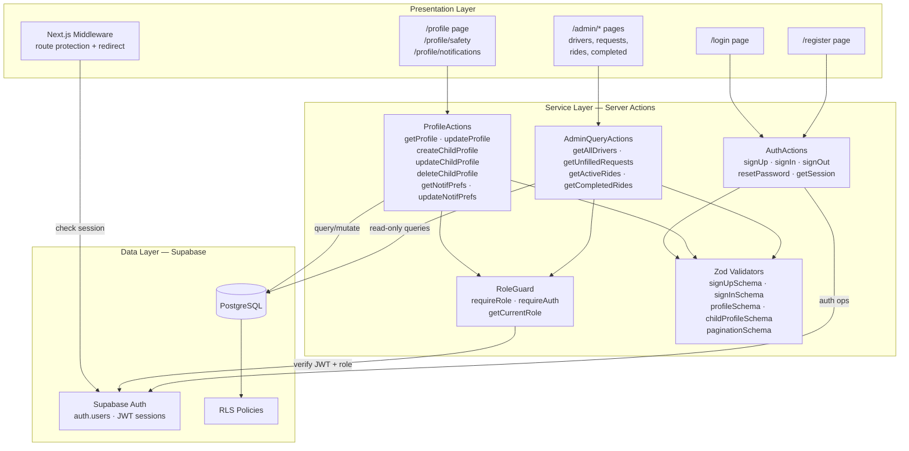

# Module 1: Auth & Identity

## 1. Module Features

### What This Module Does

The Auth & Identity module is the security and identity backbone of Ultra. It owns Layer 1 and Layer 2 tables related to user identity, and provides the cross-cutting authentication/authorization infrastructure that every other module depends on.

**Authentication:**
- Email/password registration for riders and drivers (admins are seeded, not self-registered)
- Email/password sign-in with Supabase JWT session issuance
- Sign-out with session invalidation
- Session persistence across page refreshes via Supabase Auth cookies
- Password reset flow via email link

**Authorization:**
- Role-based access control (RBAC) with three roles: `rider`, `driver`, `admin`
- Next.js middleware that intercepts requests to protected routes and redirects unauthenticated users
- Role-gated route access: riders cannot access `/admin/*` or `/driver/*`, drivers cannot access rider-only routes, admins access everything
- `requireRole()` server-action guard that throws on unauthorized access
- Row Level Security (RLS) policies enforced at the PostgreSQL level as defense-in-depth

**Profile Management (US10):**
- CRUD operations for rider profiles (name, phone, avatar)
- Multi-profile support: a single rider account can have multiple child profiles, each with their own name, photo, and emergency contacts
- Notification preference management per user (SMS/push/email toggles)

**Admin Data Access (US21–US25):**
- Paginated, searchable, filterable read queries across all domain tables (drivers, rides, requests, completed rides)
- All admin queries enforce the `admin` role before execution

### What This Module Does NOT Do

- Does not handle payment processing (Payments & Pricing module)
- Does not manage ride state transitions (Ride Lifecycle module)
- Does not stream real-time data (Real-Time & Location module)
- Does not implement driver matching algorithms (Matching & Dispatch module)
- Does not send SMS or push notifications (Safety & Notifications module)
- Does not manage driver profiles, vehicles, or availability (Matching & Dispatch module)
- Does not implement OAuth/social login (out of scope for MVP)

---

## 2. Module Architecture

### Text Description

The Auth & Identity module follows a three-layer internal architecture within the Next.js application:

**Presentation Layer:** Next.js pages (`/login`, `/register`, `/profile`, `/admin/*`) and route-protection middleware. The middleware runs on every request via `middleware.ts` at the project root, checks for a valid Supabase session, and redirects unauthenticated users to `/login`. Login and register pages are client components that use `useActionState` to manage form submission loading and error states.

**Service Layer:** Server actions organized into three files — `auth/actions.ts` for credential operations, `account-management/actions.ts` for profile CRUD, and `admin-dashboard/actions.ts` for admin read queries. Each action validates input with a Zod schema, checks authorization via `requireRole()`, and delegates to the Supabase client. Admin query actions compose Supabase queries with dynamic filters, search terms, sorting, and pagination parameters.

**Data Layer:** Supabase Auth manages the `auth.users` table (JWT sessions, password hashing, email verification). Application-level data lives in `user_roles`, `riders`, `rider_profiles`, `emergency_contacts`, and `notification_preferences` — all in Supabase PostgreSQL with RLS policies.

**Design Justification:** We use Supabase Auth rather than rolling our own because it provides battle-tested JWT session management, secure password hashing (bcrypt), email verification, and password reset — all at zero cost. Building these from scratch would introduce security vulnerabilities and consume development time that should be spent on domain features. The RLS policies provide a second authorization layer enforced by PostgreSQL itself, making it impossible for a compromised server action to leak data across tenants. For our scale target of 30 riders, 15 drivers, and 3 admins, Supabase's free tier handles all authentication and database needs with headroom to spare.

### Mermaid Architecture Diagram



---

## 3. Data Storage

This module owns tables in **Layer 1** (Identity) and **Layer 2** (Profiles) of the layered schema:

| Layer | Table | Purpose | Persistence |
|-------|-------|---------|-------------|
| — | `auth.users` | Credentials, JWT sessions (Supabase-managed) | Durable — managed by Supabase |
| L1 | `user_roles` | Maps user IDs → application roles | Durable — PostgreSQL |
| L1 | `riders` | Extended rider profile data | Durable — PostgreSQL |
| L2 | `rider_profiles` | Child profiles under a rider account | Durable — PostgreSQL |
| L2 | `emergency_contacts` | Emergency contacts per child profile | Durable — PostgreSQL |
| L2 | `notification_preferences` | Per-user SMS/push/email toggles | Durable — PostgreSQL |

No in-memory-only data structures. Every piece of user data persists to disk-backed PostgreSQL with Supabase's automatic backups.

---

## 4. Data Schemas

### `user_roles`

```sql
CREATE TABLE public.user_roles (
    id          UUID PRIMARY KEY DEFAULT gen_random_uuid(),
    user_id     UUID NOT NULL UNIQUE REFERENCES auth.users(id) ON DELETE CASCADE,
    role        TEXT NOT NULL CHECK (role IN ('rider', 'driver', 'admin')),
    created_by  UUID REFERENCES auth.users(id),
    updated_by  UUID REFERENCES auth.users(id),
    created_at  TIMESTAMPTZ NOT NULL DEFAULT now(),
    updated_at  TIMESTAMPTZ NOT NULL DEFAULT now(),
    deleted_at  TIMESTAMPTZ,
    version     INT NOT NULL DEFAULT 1
);

ALTER TABLE public.user_roles ENABLE ROW LEVEL SECURITY;

CREATE POLICY "Users read own role"
    ON public.user_roles FOR SELECT
    USING (auth.uid() = user_id);

CREATE POLICY "Admins read all roles"
    ON public.user_roles FOR SELECT
    USING (EXISTS (
        SELECT 1 FROM public.user_roles WHERE user_id = auth.uid() AND role = 'admin'
    ));
```

### `riders`

```sql
CREATE TABLE public.riders (
    id          UUID PRIMARY KEY DEFAULT gen_random_uuid(),
    user_id     UUID NOT NULL UNIQUE REFERENCES auth.users(id) ON DELETE CASCADE,
    name        TEXT NOT NULL,
    phone       TEXT,
    avatar_url  TEXT,
    created_by  UUID REFERENCES auth.users(id),
    updated_by  UUID REFERENCES auth.users(id),
    created_at  TIMESTAMPTZ NOT NULL DEFAULT now(),
    updated_at  TIMESTAMPTZ NOT NULL DEFAULT now(),
    deleted_at  TIMESTAMPTZ,
    version     INT NOT NULL DEFAULT 1
);

ALTER TABLE public.riders ENABLE ROW LEVEL SECURITY;

CREATE POLICY "Riders read own profile"
    ON public.riders FOR SELECT USING (auth.uid() = user_id);

CREATE POLICY "Riders update own profile"
    ON public.riders FOR UPDATE USING (auth.uid() = user_id);

CREATE POLICY "Admins read all riders"
    ON public.riders FOR SELECT
    USING (EXISTS (
        SELECT 1 FROM public.user_roles WHERE user_id = auth.uid() AND role = 'admin'
    ));
```

### `rider_profiles`

```sql
CREATE TABLE public.rider_profiles (
    id          UUID PRIMARY KEY DEFAULT gen_random_uuid(),
    rider_id    UUID NOT NULL REFERENCES public.riders(id) ON DELETE CASCADE,
    name        TEXT NOT NULL,
    photo_url   TEXT,
    is_child    BOOLEAN NOT NULL DEFAULT false,
    notes       TEXT,
    created_by  UUID REFERENCES auth.users(id),
    updated_by  UUID REFERENCES auth.users(id),
    created_at  TIMESTAMPTZ NOT NULL DEFAULT now(),
    updated_at  TIMESTAMPTZ NOT NULL DEFAULT now(),
    deleted_at  TIMESTAMPTZ,
    version     INT NOT NULL DEFAULT 1
);

ALTER TABLE public.rider_profiles ENABLE ROW LEVEL SECURITY;

CREATE POLICY "Riders manage own child profiles"
    ON public.rider_profiles FOR ALL
    USING (EXISTS (
        SELECT 1 FROM public.riders
        WHERE riders.id = rider_profiles.rider_id AND riders.user_id = auth.uid()
    ));
```

### `emergency_contacts`

```sql
CREATE TABLE public.emergency_contacts (
    id                UUID PRIMARY KEY DEFAULT gen_random_uuid(),
    rider_profile_id  UUID NOT NULL REFERENCES public.rider_profiles(id) ON DELETE CASCADE,
    name              TEXT NOT NULL,
    phone             TEXT NOT NULL,
    relationship      TEXT,
    is_primary        BOOLEAN NOT NULL DEFAULT false,
    created_by        UUID REFERENCES auth.users(id),
    updated_by        UUID REFERENCES auth.users(id),
    created_at        TIMESTAMPTZ NOT NULL DEFAULT now(),
    updated_at        TIMESTAMPTZ NOT NULL DEFAULT now(),
    deleted_at        TIMESTAMPTZ
);

ALTER TABLE public.emergency_contacts ENABLE ROW LEVEL SECURITY;

CREATE POLICY "Riders manage contacts for own profiles"
    ON public.emergency_contacts FOR ALL
    USING (EXISTS (
        SELECT 1 FROM public.rider_profiles
        JOIN public.riders ON riders.id = rider_profiles.rider_id
        WHERE rider_profiles.id = emergency_contacts.rider_profile_id
        AND riders.user_id = auth.uid()
    ));
```

### `notification_preferences`

```sql
CREATE TABLE public.notification_preferences (
    id            UUID PRIMARY KEY DEFAULT gen_random_uuid(),
    user_id       UUID NOT NULL UNIQUE REFERENCES auth.users(id) ON DELETE CASCADE,
    sms_enabled   BOOLEAN NOT NULL DEFAULT true,
    push_enabled  BOOLEAN NOT NULL DEFAULT true,
    email_enabled BOOLEAN NOT NULL DEFAULT true,
    updated_by    UUID REFERENCES auth.users(id),
    created_at    TIMESTAMPTZ NOT NULL DEFAULT now(),
    updated_at    TIMESTAMPTZ NOT NULL DEFAULT now()
);

ALTER TABLE public.notification_preferences ENABLE ROW LEVEL SECURITY;

CREATE POLICY "Users manage own prefs"
    ON public.notification_preferences FOR ALL
    USING (auth.uid() = user_id);
```

---

## 5. Module API

All endpoints are Next.js Server Actions unless noted otherwise.

### Authentication Actions

| Action | Input | Output | Auth |
|--------|-------|--------|------|
| `signUp(data)` | `{ email: string, password: string, role: 'rider' \| 'driver', name: string }` | `ActionResult<{ userId: string }>` | None |
| `signIn(data)` | `{ email: string, password: string }` | `ActionResult<{ userId: string, role: string }>` | None |
| `signOut()` | — | `ActionResult<void>` | Any |
| `resetPassword(data)` | `{ email: string }` | `ActionResult<void>` | None |
| `getSession()` | — | `ActionResult<{ user: User, role: string } \| null>` | None |

### Profile Management Actions

| Action | Input | Output | Auth |
|--------|-------|--------|------|
| `getProfile()` | — | `ActionResult<RiderWithProfiles>` | Rider |
| `updateProfile(data)` | `{ name?: string, phone?: string, avatar_url?: string }` | `ActionResult<Rider>` | Rider |
| `createChildProfile(data)` | `{ name: string, photo_url?: string, is_child: boolean, emergency_contacts?: Contact[] }` | `ActionResult<RiderProfile>` | Rider |
| `updateChildProfile(id, data)` | `{ id: string, name?: string, photo_url?: string, notes?: string }` | `ActionResult<RiderProfile>` | Rider |
| `deleteChildProfile(id)` | `{ id: string }` | `ActionResult<void>` | Rider |
| `getNotificationPreferences()` | — | `ActionResult<NotificationPrefs>` | Any |
| `updateNotificationPreferences(data)` | `{ sms_enabled?: boolean, push_enabled?: boolean, email_enabled?: boolean }` | `ActionResult<NotificationPrefs>` | Any |

### Admin Query Actions

| Action | Input | Output | Auth |
|--------|-------|--------|------|
| `getAllDrivers(params)` | `{ page, pageSize, search?, status?, childSafe?, sortBy?, sortDir? }` | `ActionResult<PaginatedResult<Driver>>` | Admin |
| `getUnfilledRequests(params)` | `{ page, pageSize, search?, sortBy?, sortDir? }` | `ActionResult<PaginatedResult<Ride>>` | Admin |
| `getActiveRides(params)` | `{ page, pageSize, search?, sortBy?, sortDir? }` | `ActionResult<PaginatedResult<Ride>>` | Admin |
| `getCompletedRides(params)` | `{ page, pageSize, search?, dateFrom?, dateTo?, sortBy?, sortDir? }` | `ActionResult<PaginatedResult<Ride>>` | Admin |

### Shared Types

```typescript
type ActionResult<T> =
    | { success: true; data: T }
    | { success: false; error: string };

type PaginatedResult<T> = {
    data: T[];
    total: number;
    page: number;
    pageSize: number;
    totalPages: number;
};

type Role = 'rider' | 'driver' | 'admin';
```

---

## 6. Class Diagram

```mermaid
classDiagram
    class AuthService {
        -supabase : SupabaseClient
        +signUp(email, password, role, name) ActionResult
        +signIn(email, password) ActionResult
        +signOut() ActionResult
        +resetPassword(email) ActionResult
        +getSession() ActionResult
        -assignRole(userId, role) void
        -createRiderRecord(userId, name) void
    }

    class ProfileService {
        -supabase : SupabaseClient
        +getProfile(userId) ActionResult
        +updateProfile(userId, data) ActionResult
        +createChildProfile(riderId, data) ActionResult
        +updateChildProfile(profileId, data) ActionResult
        +deleteChildProfile(profileId) ActionResult
        +getNotifPrefs(userId) ActionResult
        +updateNotifPrefs(userId, data) ActionResult
    }

    class AdminQueryService {
        -supabase : SupabaseClient
        +getAllDrivers(params) PaginatedResult
        +getUnfilledRequests(params) PaginatedResult
        +getActiveRides(params) PaginatedResult
        +getCompletedRides(params) PaginatedResult
        -buildQuery(table, params) SupabaseQuery
        -applyFilters(query, filters) SupabaseQuery
        -applySearch(query, term, columns) SupabaseQuery
        -applyPagination(query, page, size) SupabaseQuery
    }

    class RoleGuard {
        +requireRole(allowedRoles) void
        +requireAuth() User
        +getCurrentRole(userId) Role
    }

    class AuthValidator {
        +signUpSchema : ZodSchema
        +signInSchema : ZodSchema
        +profileUpdateSchema : ZodSchema
        +childProfileSchema : ZodSchema
        +paginationSchema : ZodSchema
        +notifPrefsSchema : ZodSchema
    }

    class SupabaseClientFactory {
        +createBrowserClient() SupabaseClient
        +createServerClient() SupabaseClient
        +createServiceRoleClient() SupabaseClient
    }

    class NextMiddleware {
        +middleware(request) NextResponse
        -isProtectedRoute(path) boolean
        -roleForPath(path) Role
    }

    class User {
        +id : string
        +email : string
        +role : Role
    }

    class Rider {
        +id : string
        +userId : string
        +name : string
        +phone : string
        +avatarUrl : string
    }

    class RiderProfile {
        +id : string
        +riderId : string
        +name : string
        +photoUrl : string
        +isChild : boolean
        +notes : string
    }

    class EmergencyContact {
        +id : string
        +riderProfileId : string
        +name : string
        +phone : string
        +relationship : string
        +isPrimary : boolean
    }

    class NotifPrefs {
        +id : string
        +userId : string
        +smsEnabled : boolean
        +pushEnabled : boolean
        +emailEnabled : boolean
    }

    class PaginatedResult {
        +data : list
        +total : number
        +page : number
        +pageSize : number
        +totalPages : number
    }

    AuthService --> SupabaseClientFactory : uses
    AuthService --> AuthValidator : validates with
    ProfileService --> SupabaseClientFactory : uses
    ProfileService --> AuthValidator : validates with
    ProfileService --> RoleGuard : checks auth
    AdminQueryService --> SupabaseClientFactory : uses
    AdminQueryService --> RoleGuard : checks auth
    NextMiddleware --> SupabaseClientFactory : uses

    ProfileService --> Rider : returns
    ProfileService --> RiderProfile : returns
    RiderProfile --> EmergencyContact : contains
    AdminQueryService --> PaginatedResult : returns
```



---

## 7. Module Implementation

### GitHub Issues

- **#10** — Set up Supabase project and client utilities
- **#11** — Design and create riders table schema
- **#16** — Create admin users table and role system
- **#17** — Set up Supabase Auth with email/password
- **#18** — Implement role-based middleware and route protection
- **#19** — Create login/register UI pages
- **#20** — Set up API error handling and Zod validation patterns
- **#24** — Rider profile and account management API (US10)
- **#35** — Admin drivers table API with search/filter (US21, US25)
- **#36** — Admin ride requests table API (US22, US25)
- **#37** — Admin active rides and completed rides API (US23, US24, US25)
- **#38** — Admin driver flag review and management

### File Structure

```
src/
├── lib/
│   ├── supabase.ts                       # Browser client factory
│   ├── supabase-server.ts                # Server client factory (service role)
│   └── validators/
│       ├── auth.ts                       # signUp, signIn Zod schemas
│       ├── profile.ts                    # profile, childProfile schemas
│       └── pagination.ts                 # Shared pagination + filter schema
├── features/
│   ├── auth/
│   │   ├── actions.ts                    # signUp, signIn, signOut, resetPassword, getSession
│   │   ├── role-guard.ts                 # requireRole, requireAuth, getCurrentRole
│   │   └── __tests__/
│   │       └── auth.test.ts
│   ├── account-management/
│   │   ├── actions.ts                    # profile CRUD, child profiles, notif prefs
│   │   └── __tests__/
│   │       └── account-management.test.ts
│   └── admin-dashboard/
│       ├── actions.ts                    # getAllDrivers, getUnfilledRequests, etc.
│       └── __tests__/
│           └── admin-dashboard.test.ts
├── middleware.ts                          # Next.js route protection
└── app/
    ├── login/page.tsx
    └── register/page.tsx
```
