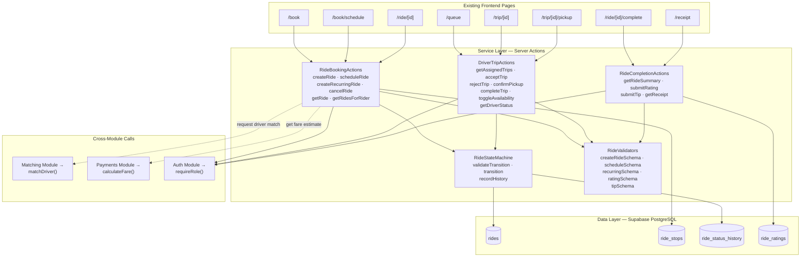
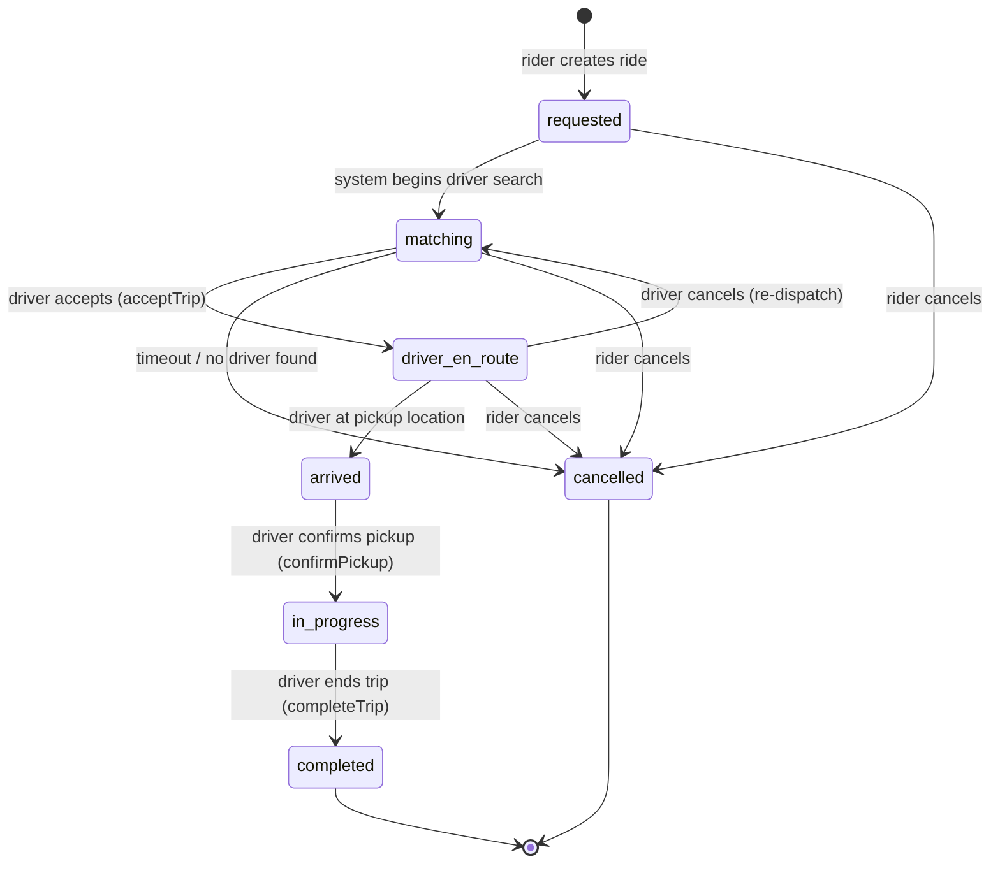
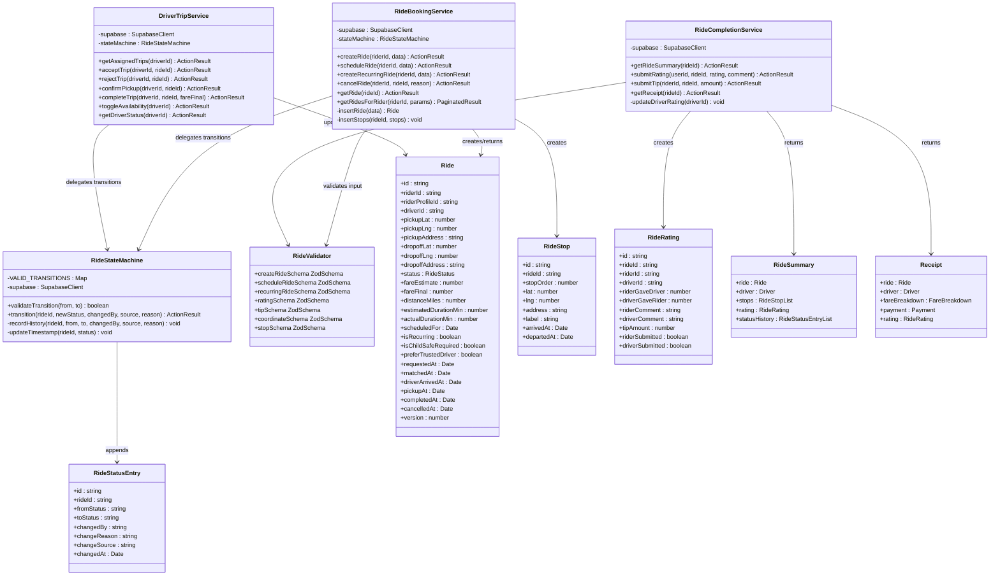

# Module 2: Ride Lifecycle

## 1. Module Features

### What This Module Does

The Ride Lifecycle module is the central domain module of Ultra. It manages every ride from creation through completion, including the ride state machine, booking flows, scheduling, driver trip operations, and post-ride rating and tipping. It owns all Layer 3 tables plus the `ride_ratings` table from Layer 4.

**Ride Creation & Booking:**
- Create an immediate ride request with pickup/dropoff coordinates and addresses (US12)
- Book a ride up to 7 days in advance with a confirmed pickup time (US02)
- Schedule recurring rides on specific days and times using iCal RRULE format (US01)
- Store intermediate stops for multi-stop rides
- Attach a child profile to a ride when booking for a child
- Flag rides as child-safe-required or prefer-trusted-driver for the Matching module
- Validate all inputs: coordinates within service area, future-dated schedules, valid recurrence rules

**Ride State Machine:**
- Manage ride status transitions through a strict state machine: `requested → matching → driver_en_route → arrived → in_progress → completed` (or `cancelled` from any pre-completion state)
- Record every transition in `ride_status_history` with from/to status, who triggered it, and the source (rider, driver, system, or admin)
- Enforce valid transitions — reject invalid state jumps (e.g., `requested` directly to `completed`)
- Provide optimistic concurrency via the `version` column to prevent race conditions on simultaneous updates

**Driver Trip Operations (US18–US20):**
- Fetch pending trip assignments for a logged-in driver
- Accept a trip: transition ride to `driver_en_route`, assign `driver_id`, record `matched_at` timestamp
- Reject a trip: return ride to `matching` status for the Matching module to re-dispatch
- Confirm passenger pickup: transition to `in_progress`, record `pickup_at` timestamp
- Complete a trip: transition to `completed`, set `fare_final`, record `completed_at` timestamp
- Toggle driver availability between `available` and `offline`
- Get current driver status and active trip

**Ride Completion & Rating (US07, US17):**
- Fetch completed ride summary with fare breakdown
- Submit star rating (1–5) and optional text comment from rider to driver
- Submit star rating from driver to rider
- Submit optional tip amount
- Fetch historical receipt for a completed ride

**Ride Queries:**
- Get a single ride by ID with joined driver details
- List all rides for a rider with pagination and status filtering
- List all rides for a driver with pagination

### What This Module Does NOT Do

- Does not find or rank available drivers — delegates to Matching & Dispatch module via function call
- Does not calculate fares — calls Payments & Pricing module for fare estimates
- Does not process or capture payments — delegates to Payments & Pricing module
- Does not stream real-time updates — the Real-Time module subscribes to `rides` table changes
- Does not send notifications — the Safety & Notifications module reacts to status changes
- Does not manage driver profiles, vehicles, or certifications — owned by Matching & Dispatch
- Does not manage rider profiles — owned by Auth & Identity

---

## 2. Module Architecture

### Text Description

The module is structured around a central **RideStateMachine** class that enforces all status transitions. Every mutation operation (create, accept, pickup, complete, cancel) passes through this state machine, which validates the current status, executes the transition atomically, and records the change in the audit trail.

**Presentation Layer:** This module serves existing frontend pages through server actions. Rider pages (`/book`, `/book/schedule`, `/ride/[id]`, `/ride/[id]/complete`, `/receipt`) call ride booking and completion actions. Driver pages (`/queue`, `/trip/[id]`, `/trip/[id]/pickup`) call driver trip actions. No new pages are created — the frontend already exists from P2.

**Service Layer:** Three groups of server actions, each in its own file:
- `ride-booking/actions.ts` — rider-initiated operations (create, schedule, cancel, query)
- `driver-trips/actions.ts` — driver-initiated operations (accept, reject, pickup, complete)
- `ride-completion/actions.ts` — post-ride operations (summary, rating, tip, receipt)

All three share the `RideStateMachine` class and use Zod validators from a shared `ride-validators.ts`.

**Data Layer:** The `rides` table is the primary entity. `ride_stops` stores intermediate waypoints. `ride_status_history` is an append-only audit log. `ride_ratings` stores post-ride feedback. All tables use RLS policies scoped to ride participants (riders see their rides, drivers see assigned rides, admins see all).

**Design Justification:** The state machine pattern is the correct choice because rides have a well-defined set of states with constrained transitions, and invalid transitions can cause real-world harm (e.g., marking a ride "completed" before pickup causes incorrect billing). Encoding valid transitions in a single class provides a single source of truth for business rules, prevents invalid jumps, and makes the system trivially testable — we can enumerate every valid and invalid transition in unit tests. The audit trail in `ride_status_history` supports dispute resolution ("when exactly did the driver arrive?") and debugging. Separating rider, driver, and completion actions into different files keeps each concern focused and independently testable, while the shared state machine ensures consistency across all entry points.

### Mermaid Architecture Diagram



### Ride State Machine Diagram



---

## 3. Data Storage

This module owns tables in **Layer 3** (Rides) and one table in **Layer 4** (Transactions):

| Layer | Table | Purpose | Persistence |
|-------|-------|---------|-------------|
| L3 | `rides` | Current state of every ride | Durable — PostgreSQL |
| L3 | `ride_stops` | Intermediate waypoints for multi-stop rides | Durable — PostgreSQL |
| L3 | `ride_status_history` | Append-only audit trail of state transitions | Durable — PostgreSQL |
| L4 | `ride_ratings` | Post-ride feedback, tips | Durable — PostgreSQL |

The `rides` table is the most frequently read and written table in the system. At our scale (30 riders, 15 drivers), PostgreSQL handles concurrent reads/writes trivially. The `ride_status_history` table is append-only — rows are never updated or deleted, ensuring an immutable audit trail.

---

## 4. Data Schemas

### `rides`

```sql
CREATE TABLE public.rides (
    id                      UUID PRIMARY KEY DEFAULT gen_random_uuid(),
    rider_id                UUID NOT NULL REFERENCES public.riders(id),
    rider_profile_id        UUID REFERENCES public.rider_profiles(id),
    driver_id               UUID REFERENCES public.drivers(id),
    pickup_lat              DOUBLE PRECISION NOT NULL,
    pickup_lng              DOUBLE PRECISION NOT NULL,
    pickup_address          TEXT NOT NULL,
    dropoff_lat             DOUBLE PRECISION NOT NULL,
    dropoff_lng             DOUBLE PRECISION NOT NULL,
    dropoff_address         TEXT NOT NULL,
    status                  TEXT NOT NULL DEFAULT 'requested'
                            CHECK (status IN (
                                'requested','matching','driver_en_route',
                                'arrived','in_progress','completed','cancelled'
                            )),
    fare_estimate           NUMERIC(10,2),
    fare_final              NUMERIC(10,2),
    distance_miles          NUMERIC(10,2),
    estimated_duration_min  INT,
    actual_duration_min     INT,
    cancel_reason           TEXT,
    cancelled_by            UUID REFERENCES auth.users(id),
    scheduled_for           TIMESTAMPTZ,
    is_recurring            BOOLEAN NOT NULL DEFAULT false,
    recurrence_rule         TEXT,
    is_child_safe_required  BOOLEAN NOT NULL DEFAULT false,
    prefer_trusted_driver   BOOLEAN NOT NULL DEFAULT false,
    requested_at            TIMESTAMPTZ NOT NULL DEFAULT now(),
    matched_at              TIMESTAMPTZ,
    driver_arrived_at       TIMESTAMPTZ,
    pickup_at               TIMESTAMPTZ,
    completed_at            TIMESTAMPTZ,
    cancelled_at            TIMESTAMPTZ,
    created_by              UUID REFERENCES auth.users(id),
    updated_by              UUID REFERENCES auth.users(id),
    created_at              TIMESTAMPTZ NOT NULL DEFAULT now(),
    updated_at              TIMESTAMPTZ NOT NULL DEFAULT now(),
    deleted_at              TIMESTAMPTZ,
    version                 INT NOT NULL DEFAULT 1
);

CREATE INDEX idx_rides_rider_id ON public.rides(rider_id);
CREATE INDEX idx_rides_driver_id ON public.rides(driver_id);
CREATE INDEX idx_rides_status ON public.rides(status);
CREATE INDEX idx_rides_scheduled_for ON public.rides(scheduled_for) WHERE scheduled_for IS NOT NULL;

ALTER TABLE public.rides ENABLE ROW LEVEL SECURITY;

CREATE POLICY "Riders read own rides" ON public.rides FOR SELECT
    USING (rider_id IN (SELECT id FROM public.riders WHERE user_id = auth.uid()));

CREATE POLICY "Riders insert own rides" ON public.rides FOR INSERT
    WITH CHECK (rider_id IN (SELECT id FROM public.riders WHERE user_id = auth.uid()));

CREATE POLICY "Drivers read assigned rides" ON public.rides FOR SELECT
    USING (driver_id IN (SELECT id FROM public.drivers WHERE user_id = auth.uid()));

CREATE POLICY "Drivers update assigned rides" ON public.rides FOR UPDATE
    USING (driver_id IN (SELECT id FROM public.drivers WHERE user_id = auth.uid()));

CREATE POLICY "Service role full access" ON public.rides FOR ALL
    USING (auth.jwt()->>'role' = 'service_role')
    WITH CHECK (auth.jwt()->>'role' = 'service_role');

CREATE POLICY "Admins read all rides" ON public.rides FOR SELECT
    USING (EXISTS (
        SELECT 1 FROM public.user_roles WHERE user_id = auth.uid() AND role = 'admin'
    ));
```

### `ride_stops`

```sql
CREATE TABLE public.ride_stops (
    id          UUID PRIMARY KEY DEFAULT gen_random_uuid(),
    ride_id     UUID NOT NULL REFERENCES public.rides(id) ON DELETE CASCADE,
    stop_order  INT NOT NULL,
    lat         DOUBLE PRECISION NOT NULL,
    lng         DOUBLE PRECISION NOT NULL,
    address     TEXT NOT NULL,
    label       TEXT,
    arrived_at  TIMESTAMPTZ,
    departed_at TIMESTAMPTZ,
    created_by  UUID REFERENCES auth.users(id),
    created_at  TIMESTAMPTZ NOT NULL DEFAULT now(),
    updated_at  TIMESTAMPTZ NOT NULL DEFAULT now(),
    UNIQUE(ride_id, stop_order)
);

ALTER TABLE public.ride_stops ENABLE ROW LEVEL SECURITY;

CREATE POLICY "Ride participants read stops" ON public.ride_stops FOR SELECT
    USING (EXISTS (
        SELECT 1 FROM public.rides WHERE rides.id = ride_stops.ride_id
        AND (
            rides.rider_id IN (SELECT id FROM public.riders WHERE user_id = auth.uid())
            OR rides.driver_id IN (SELECT id FROM public.drivers WHERE user_id = auth.uid())
        )
    ));
```

### `ride_status_history`

```sql
CREATE TABLE public.ride_status_history (
    id             UUID PRIMARY KEY DEFAULT gen_random_uuid(),
    ride_id        UUID NOT NULL REFERENCES public.rides(id) ON DELETE CASCADE,
    from_status    TEXT,
    to_status      TEXT NOT NULL,
    changed_by     UUID REFERENCES auth.users(id),
    change_reason  TEXT,
    change_source  TEXT NOT NULL CHECK (change_source IN ('rider','driver','system','admin')),
    changed_at     TIMESTAMPTZ NOT NULL DEFAULT now(),
    created_at     TIMESTAMPTZ NOT NULL DEFAULT now()
);

CREATE INDEX idx_ride_status_history_ride_id ON public.ride_status_history(ride_id);

ALTER TABLE public.ride_status_history ENABLE ROW LEVEL SECURITY;

CREATE POLICY "Ride participants read history" ON public.ride_status_history FOR SELECT
    USING (EXISTS (
        SELECT 1 FROM public.rides WHERE rides.id = ride_status_history.ride_id
        AND (
            rides.rider_id IN (SELECT id FROM public.riders WHERE user_id = auth.uid())
            OR rides.driver_id IN (SELECT id FROM public.drivers WHERE user_id = auth.uid())
        )
    ));

CREATE POLICY "Admins read all history" ON public.ride_status_history FOR SELECT
    USING (EXISTS (
        SELECT 1 FROM public.user_roles WHERE user_id = auth.uid() AND role = 'admin'
    ));
```

### `ride_ratings`

```sql
CREATE TABLE public.ride_ratings (
    id                UUID PRIMARY KEY DEFAULT gen_random_uuid(),
    ride_id           UUID NOT NULL UNIQUE REFERENCES public.rides(id) ON DELETE CASCADE,
    rider_id          UUID NOT NULL REFERENCES public.riders(id),
    driver_id         UUID NOT NULL REFERENCES public.drivers(id),
    rider_gave_driver INT CHECK (rider_gave_driver BETWEEN 1 AND 5),
    driver_gave_rider INT CHECK (driver_gave_rider BETWEEN 1 AND 5),
    rider_comment     TEXT,
    driver_comment    TEXT,
    tip_amount        NUMERIC(10,2) NOT NULL DEFAULT 0.00,
    rider_submitted   BOOLEAN NOT NULL DEFAULT false,
    driver_submitted  BOOLEAN NOT NULL DEFAULT false,
    created_by        UUID REFERENCES auth.users(id),
    updated_by        UUID REFERENCES auth.users(id),
    created_at        TIMESTAMPTZ NOT NULL DEFAULT now(),
    updated_at        TIMESTAMPTZ NOT NULL DEFAULT now()
);

ALTER TABLE public.ride_ratings ENABLE ROW LEVEL SECURITY;

CREATE POLICY "Ride participants manage ratings" ON public.ride_ratings FOR ALL
    USING (EXISTS (
        SELECT 1 FROM public.rides WHERE rides.id = ride_ratings.ride_id
        AND (
            rides.rider_id IN (SELECT id FROM public.riders WHERE user_id = auth.uid())
            OR rides.driver_id IN (SELECT id FROM public.drivers WHERE user_id = auth.uid())
        )
    ))
    WITH CHECK (EXISTS (
        SELECT 1 FROM public.rides WHERE rides.id = ride_ratings.ride_id
        AND (
            rides.rider_id IN (SELECT id FROM public.riders WHERE user_id = auth.uid())
            OR rides.driver_id IN (SELECT id FROM public.drivers WHERE user_id = auth.uid())
        )
    ));
```

---

## 5. Module API

### Ride Booking Actions (Rider)

| Action | Input | Output | Auth |
|--------|-------|--------|------|
| `createRide(data)` | `{ pickup_lat, pickup_lng, pickup_address, dropoff_lat, dropoff_lng, dropoff_address, is_child_safe_required?, rider_profile_id?, prefer_trusted_driver?, stops?: Stop[] }` | `ActionResult<Ride>` | Rider |
| `scheduleRide(data)` | Same + `{ scheduled_for: string (ISO 8601) }` | `ActionResult<Ride>` | Rider |
| `createRecurringRide(data)` | Same + `{ recurrence_rule: string (iCal RRULE) }` | `ActionResult<Ride>` | Rider |
| `cancelRide(rideId)` | `{ rideId: string, reason?: string }` | `ActionResult<Ride>` | Rider |
| `getRide(rideId)` | `{ rideId: string }` | `ActionResult<RideWithDriver>` | Rider or Driver |
| `getRidesForRider(params)` | `{ page, pageSize, status? }` | `ActionResult<PaginatedResult<Ride>>` | Rider |

### Driver Trip Actions

| Action | Input | Output | Auth |
|--------|-------|--------|------|
| `getAssignedTrips()` | — | `ActionResult<Ride[]>` | Driver |
| `acceptTrip(rideId)` | `{ rideId: string }` | `ActionResult<Ride>` | Driver |
| `rejectTrip(rideId)` | `{ rideId: string }` | `ActionResult<void>` | Driver |
| `confirmPickup(rideId)` | `{ rideId: string }` | `ActionResult<Ride>` | Driver |
| `completeTrip(rideId, fareFinal)` | `{ rideId: string, fare_final: number }` | `ActionResult<Ride>` | Driver |
| `toggleDriverAvailability()` | — | `ActionResult<{ status: string }>` | Driver |
| `getDriverStatus()` | — | `ActionResult<{ status: string, activeTrip?: Ride }>` | Driver |

### Ride Completion Actions

| Action | Input | Output | Auth |
|--------|-------|--------|------|
| `getRideSummary(rideId)` | `{ rideId: string }` | `ActionResult<RideSummary>` | Rider |
| `submitRating(data)` | `{ rideId: string, rating: number (1-5), comment?: string }` | `ActionResult<void>` | Rider or Driver |
| `submitTip(data)` | `{ rideId: string, amount: number }` | `ActionResult<void>` | Rider |
| `getReceipt(rideId)` | `{ rideId: string }` | `ActionResult<Receipt>` | Rider |

---

## 6. Class Diagram



---

## 7. Module Implementation

### GitHub Issues

- **#13** — Design and create rides table schema
- **#21** — Ride booking API — create, schedule, and cancel rides (US01, US02, US11, US12)
- **#22** — Driver trip operations API (US18, US19, US20)
- **#23** — Ride completion and rating API (US07, US17)

### File Structure

```
src/features/
├── ride-booking/
│   ├── actions.ts                   # createRide, scheduleRide, createRecurringRide, cancelRide, getRide, getRidesForRider
│   ├── state-machine.ts             # RideStateMachine — validates & executes transitions
│   ├── validators.ts                # Zod schemas for ride inputs
│   ├── types.ts                     # Ride, RideStop, RideStatus, RideSummary, Receipt
│   └── __tests__/
│       ├── ride-booking.test.ts
│       └── state-machine.test.ts
├── driver-trips/
│   ├── actions.ts                   # getAssignedTrips, acceptTrip, rejectTrip, confirmPickup, completeTrip, toggleAvailability
│   └── __tests__/
│       └── driver-trips.test.ts
└── ride-completion/
    ├── actions.ts                   # getRideSummary, submitRating, submitTip, getReceipt
    └── __tests__/
        └── ride-completion.test.ts
```
