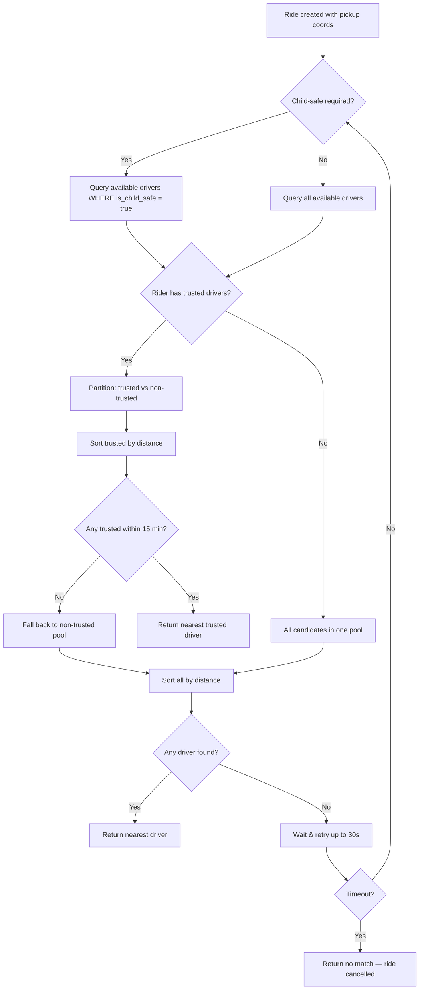
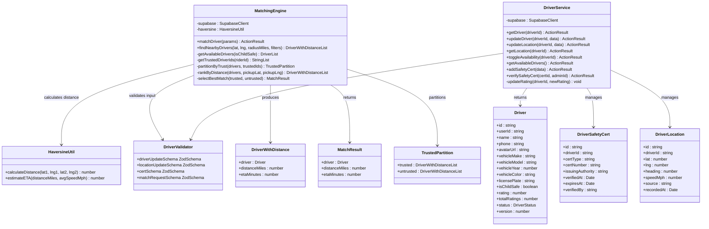

# Module 3: Matching & Dispatch

## 1. Module Features

### What This Module Does

The Matching & Dispatch module manages the driver side of Ultra — driver profiles, vehicle information, safety certifications, real-time availability, and the driver-to-ride matching algorithm. It owns the `drivers`, `driver_safety_certs`, and `driver_locations` tables from Layers 1 and 2.

**Driver Profiles & Vehicles:**
- Store and retrieve driver profile data (name, phone, avatar, vehicle details)
- Track vehicle information: make, model, year, color, license plate
- Manage child-safe certification status
- Maintain aggregate driver rating (rolling average) and total rating count

**Safety Certifications:**
- Store safety certifications per driver (child seat, first aid, background check)
- Track certification number, issuing authority, verification date, and expiration
- Record which admin verified each certification
- Query certified drivers by certification type

**Driver Availability & Location:**
- Track each driver's current status: `offline`, `available`, or `on_trip`
- Store latest GPS coordinates, heading, and speed for each active driver
- Upsert location data (one row per driver, always the latest position)
- Query available drivers within a geographic radius of a pickup point

**Matching Algorithm:**
- Find the nearest available driver to a ride's pickup coordinates using the Haversine distance formula
- Filter by `is_child_safe = true` when the ride requires child safety
- Prefer trusted drivers: if the rider has trusted drivers on their list, try those first before falling back to the general pool
- Rank candidates by distance (nearest first) after applying filters
- Handle timeout: if no driver is found within 30 seconds, return a failure so the Ride Lifecycle module can cancel the ride
- Support re-dispatch: when a driver rejects or cancels, the matching algorithm runs again excluding that driver

### What This Module Does NOT Do

- Does not manage ride state transitions — that's the Ride Lifecycle module
- Does not handle driver authentication or login — that's Auth & Identity
- Does not process payments to drivers — that's Payments & Pricing
- Does not broadcast driver location to riders in real-time — that's Real-Time & Location (this module just stores the latest position)
- Does not manage the trusted driver list — that's Safety & Notifications (this module reads it during matching)
- Does not send notifications to drivers about new assignments — that's Safety & Notifications

---

## 2. Module Architecture

### Text Description

The Matching & Dispatch module is split into two concerns: **driver data management** (CRUD for profiles, certs, locations) and the **matching engine** (algorithm that pairs rides with drivers).

**Presentation Layer:** Driver profile pages are served by the Auth & Identity module's UI. This module provides the server actions that those pages call. The matching engine has no direct UI — it's invoked programmatically by the Ride Lifecycle module when a new ride is created.

**Service Layer:** Two services:
- `DriverService` — CRUD operations for driver profiles, certifications, and location updates. Called by driver-facing UI and by the admin dashboard.
- `MatchingEngine` — Stateless algorithm that takes a ride's requirements (pickup coords, child-safe flag, rider's trusted driver list) and returns the best available driver. Uses the Haversine formula for distance calculation at our scale of 15 drivers — no geospatial index needed.

**Data Layer:** Three tables owned by this module:
- `drivers` (Layer 1) — profile, vehicle, status, rating
- `driver_safety_certs` (Layer 2) — certifications
- `driver_locations` (Layer 2) — latest GPS position per driver

The module also reads (but does not write) `trusted_drivers` from the Safety module during matching.

**Design Justification:** Separating the matching engine from driver data management keeps the algorithm independently testable and replaceable. The Haversine formula is the right choice at our scale (15 drivers) — it computes distance between two lat/lng points in O(1) time, which means matching across all 15 drivers is O(15). PostGIS or Redis geospatial indexes would be premature optimization. The matching engine is stateless — it queries current driver positions and availability on every call, so there's no stale cache to invalidate. The re-dispatch flow works naturally: the Ride Lifecycle module simply calls `matchDriver()` again with an exclusion list.

### Mermaid Architecture Diagram

```mermaid
graph TB
    subgraph Callers["Callers"]
        RL["Ride Lifecycle Module<br/>(calls matchDriver on ride creation)"]
        RT["Real-Time Module<br/>(reads driver_locations)"]
        AD["Admin Dashboard<br/>(reads driver profiles)"]
        DU["Driver UI<br/>(updates location & availability)"]
    end

    subgraph Service["Service Layer"]
        DS[DriverService<br/>getDriver · updateDriver<br/>updateLocation · toggleStatus<br/>getCerts · addCert]
        ME[MatchingEngine<br/>matchDriver · findNearbyDrivers<br/>filterByRequirements<br/>rankByDistance]
        HV[Haversine<br/>calculateDistance(lat1,lng1,lat2,lng2)]
        DV[DriverValidators<br/>driverUpdateSchema<br/>locationSchema · certSchema]
    end

    subgraph Data["Data Layer — Supabase PostgreSQL"]
        DR[(drivers)]
        DSC[(driver_safety_certs)]
        DL[(driver_locations)]
        TD[(trusted_drivers<br/>READ ONLY — owned by Safety)]
    end

    RL --> ME
    DU --> DS
    AD --> DS
    RT --> DL

    DS --> DV
    ME --> HV

    DS --> DR
    DS --> DSC
    DS --> DL
    ME --> DR
    ME --> DL
    ME -.->|read trusted list| TD
```

### Matching Algorithm Flow



---

## 3. Data Storage

| Layer | Table | Purpose | Persistence |
|-------|-------|---------|-------------|
| L1 | `drivers` | Driver profiles, vehicle info, status, rating | Durable — PostgreSQL |
| L2 | `driver_safety_certs` | Safety certifications with expiry | Durable — PostgreSQL |
| L2 | `driver_locations` | Latest GPS position per driver (upsert) | Durable — PostgreSQL |

`driver_locations` uses an upsert pattern — each driver has exactly one row that's overwritten on every location update. This keeps the table small (max 15 rows at our scale). Historical location data is not stored — the Real-Time module broadcasts positions ephemerally via Supabase Realtime.

---

## 4. Data Schemas

### `drivers`

```sql
CREATE TABLE public.drivers (
    id              UUID PRIMARY KEY DEFAULT gen_random_uuid(),
    user_id         UUID NOT NULL UNIQUE REFERENCES auth.users(id) ON DELETE CASCADE,
    name            TEXT NOT NULL,
    phone           TEXT,
    avatar_url      TEXT,
    vehicle_make    TEXT,
    vehicle_model   TEXT,
    vehicle_year    INT,
    vehicle_color   TEXT,
    license_plate   TEXT UNIQUE,
    is_child_safe   BOOLEAN NOT NULL DEFAULT false,
    rating          NUMERIC(3,2) NOT NULL DEFAULT 5.00,
    total_ratings   INT NOT NULL DEFAULT 0,
    status          TEXT NOT NULL DEFAULT 'offline'
                    CHECK (status IN ('offline', 'available', 'on_trip')),
    created_by      UUID REFERENCES auth.users(id),
    updated_by      UUID REFERENCES auth.users(id),
    created_at      TIMESTAMPTZ NOT NULL DEFAULT now(),
    updated_at      TIMESTAMPTZ NOT NULL DEFAULT now(),
    deleted_at      TIMESTAMPTZ,
    version         INT NOT NULL DEFAULT 1
);

CREATE INDEX idx_drivers_status ON public.drivers(status);
CREATE INDEX idx_drivers_child_safe ON public.drivers(is_child_safe) WHERE is_child_safe = true;

ALTER TABLE public.drivers ENABLE ROW LEVEL SECURITY;

CREATE POLICY "Drivers read own profile" ON public.drivers FOR SELECT
    USING (auth.uid() = user_id);

CREATE POLICY "Drivers update own profile" ON public.drivers FOR UPDATE
    USING (auth.uid() = user_id);

CREATE POLICY "Riders read driver profiles" ON public.drivers FOR SELECT
    USING (EXISTS (
        SELECT 1 FROM public.user_roles WHERE user_id = auth.uid() AND role IN ('rider', 'admin')
    ));

CREATE POLICY "Admins full access" ON public.drivers FOR ALL
    USING (EXISTS (
        SELECT 1 FROM public.user_roles WHERE user_id = auth.uid() AND role = 'admin'
    ))
    WITH CHECK (EXISTS (
        SELECT 1 FROM public.user_roles WHERE user_id = auth.uid() AND role = 'admin'
    ));

CREATE POLICY "Service role full access" ON public.drivers FOR ALL
    USING (auth.jwt()->>'role' = 'service_role')
    WITH CHECK (auth.jwt()->>'role' = 'service_role');
```

### `driver_safety_certs`

```sql
CREATE TABLE public.driver_safety_certs (
    id                  UUID PRIMARY KEY DEFAULT gen_random_uuid(),
    driver_id           UUID NOT NULL REFERENCES public.drivers(id) ON DELETE CASCADE,
    cert_type           TEXT NOT NULL,
    cert_number         TEXT,
    issuing_authority   TEXT,
    verified_at         TIMESTAMPTZ,
    expires_at          TIMESTAMPTZ,
    verified_by         UUID REFERENCES auth.users(id),
    created_by          UUID REFERENCES auth.users(id),
    updated_by          UUID REFERENCES auth.users(id),
    created_at          TIMESTAMPTZ NOT NULL DEFAULT now(),
    updated_at          TIMESTAMPTZ NOT NULL DEFAULT now(),
    deleted_at          TIMESTAMPTZ
);

CREATE INDEX idx_driver_certs_driver_id ON public.driver_safety_certs(driver_id);

ALTER TABLE public.driver_safety_certs ENABLE ROW LEVEL SECURITY;

CREATE POLICY "Drivers read own certs" ON public.driver_safety_certs FOR SELECT
    USING (EXISTS (
        SELECT 1 FROM public.drivers WHERE drivers.id = driver_safety_certs.driver_id AND drivers.user_id = auth.uid()
    ));

CREATE POLICY "Admins manage certs" ON public.driver_safety_certs FOR ALL
    USING (EXISTS (
        SELECT 1 FROM public.user_roles WHERE user_id = auth.uid() AND role = 'admin'
    ))
    WITH CHECK (EXISTS (
        SELECT 1 FROM public.user_roles WHERE user_id = auth.uid() AND role = 'admin'
    ));
```

### `driver_locations`

```sql
CREATE TABLE public.driver_locations (
    id          UUID PRIMARY KEY DEFAULT gen_random_uuid(),
    driver_id   UUID NOT NULL UNIQUE REFERENCES public.drivers(id) ON DELETE CASCADE,
    lat         DOUBLE PRECISION NOT NULL,
    lng         DOUBLE PRECISION NOT NULL,
    heading     DOUBLE PRECISION,
    speed_mph   DOUBLE PRECISION,
    source      TEXT NOT NULL DEFAULT 'gps' CHECK (source IN ('gps', 'manual', 'simulated')),
    recorded_at TIMESTAMPTZ NOT NULL DEFAULT now(),
    created_at  TIMESTAMPTZ NOT NULL DEFAULT now(),
    updated_at  TIMESTAMPTZ NOT NULL DEFAULT now()
);

ALTER TABLE public.driver_locations ENABLE ROW LEVEL SECURITY;

CREATE POLICY "Drivers upsert own location" ON public.driver_locations FOR ALL
    USING (EXISTS (
        SELECT 1 FROM public.drivers WHERE drivers.id = driver_locations.driver_id AND drivers.user_id = auth.uid()
    ))
    WITH CHECK (EXISTS (
        SELECT 1 FROM public.drivers WHERE drivers.id = driver_locations.driver_id AND drivers.user_id = auth.uid()
    ));

CREATE POLICY "Riders read driver locations" ON public.driver_locations FOR SELECT
    USING (EXISTS (
        SELECT 1 FROM public.user_roles WHERE user_id = auth.uid() AND role IN ('rider', 'admin')
    ));

CREATE POLICY "Service role full access" ON public.driver_locations FOR ALL
    USING (auth.jwt()->>'role' = 'service_role')
    WITH CHECK (auth.jwt()->>'role' = 'service_role');
```

---

## 5. Module API

### Driver Profile Actions

| Action | Input | Output | Auth |
|--------|-------|--------|------|
| `getDriver(driverId)` | `{ driverId: string }` | `ActionResult<DriverWithCerts>` | Driver (own) or Admin |
| `updateDriver(data)` | `{ name?, phone?, avatar_url?, vehicle_make?, vehicle_model?, vehicle_year?, vehicle_color?, license_plate? }` | `ActionResult<Driver>` | Driver (own) |
| `addSafetyCert(data)` | `{ driver_id, cert_type, cert_number?, issuing_authority?, expires_at? }` | `ActionResult<DriverSafetyCert>` | Admin |
| `verifySafetyCert(certId)` | `{ certId: string }` | `ActionResult<DriverSafetyCert>` | Admin |

### Driver Status & Location Actions

| Action | Input | Output | Auth |
|--------|-------|--------|------|
| `updateDriverLocation(data)` | `{ lat: number, lng: number, heading?: number, speed_mph?: number }` | `ActionResult<void>` | Driver |
| `getDriverLocation(driverId)` | `{ driverId: string }` | `ActionResult<DriverLocation>` | Rider or Admin |
| `toggleDriverAvailability()` | — | `ActionResult<{ status: string }>` | Driver |
| `getAvailableDrivers()` | — | `ActionResult<Driver[]>` | Admin |

### Matching Actions (called by Ride Lifecycle module, not by UI)

| Action | Input | Output | Auth |
|--------|-------|--------|------|
| `matchDriver(params)` | `{ pickup_lat, pickup_lng, is_child_safe_required, rider_id, exclude_driver_ids? }` | `ActionResult<{ driver: Driver, distance_miles: number, eta_minutes: number } \| null>` | Service (internal) |
| `findNearbyDrivers(params)` | `{ lat, lng, radius_miles?, is_child_safe? }` | `ActionResult<DriverWithDistance[]>` | Service (internal) |

---

## 6. Class Diagram



---

## 7. Module Implementation

### GitHub Issues

- **#12** — Design and create drivers table schema
- **#30** — Ride matching engine — assign nearest available driver

### File Structure

```
src/features/
├── ride-scheduling/
│   ├── actions.ts                   # createRide, scheduleRide, createRecurringRide, matchDriver
│   └── __tests__/
│       ├── ride-actions.test.ts
│       └── ride-matching.test.ts
├── ride-tracking/
│   ├── actions.ts                   # getRideStatus DB mapping for rider screens
│   └── __tests__/
│       └── ride-tracking-actions.test.ts
└── driver-management/
    └── ...
```

### Current Issue #30 Implementation

- `createRide()` now persists immediate ride requests in `matching` status instead of `requested`.
- `matchDriver(rideId)` lives in `ultra-web/src/features/ride-scheduling/actions.ts`.
- Matching uses a simple Haversine distance calculation in the application layer.
- Candidate filtering is intentionally small-scale and optimized for the course target of roughly 15 active drivers:
  - only `drivers.status = 'available'`
  - require `drivers.is_child_safe = true` when `rides.is_child_safe_required = true`
  - when `rides.prefer_trusted_driver = true`, rank `trusted_drivers` ahead of non-trusted drivers, then break ties by distance
- Successful matches update:
  - `rides.driver_id`
  - `rides.status = 'driver_en_route'`
  - `rides.matched_at`
  - `ride_status_history` with `change_source = 'system'`
- Unmatched rides are cancelled once the matching window exceeds 30 seconds:
  - `rides.status = 'cancelled'`
  - `rides.cancel_reason = 'No driver found within matching timeout.'`
  - `rides.cancelled_at`
  - `ride_status_history` audit entry
- Rider polling in `ultra-web/src/app/api/rides/[id]/status/route.ts` now attempts matching when the current ride is still in `matching`, allowing the waiting screen to transition into the matched state without blocking the initial booking form submit.
- `ultra-web/src/features/ride-tracking/actions.ts` now maps joined driver details from `drivers(...)` so matched rider screens show the assigned driver's real name, vehicle, and plate instead of only a fallback mock driver identity.

### Verification Notes

- Unit coverage for issue #30 currently lives in:
  - `ultra-web/src/features/ride-scheduling/__tests__/ride-actions.test.ts`
  - `ultra-web/src/features/ride-scheduling/__tests__/ride-matching.test.ts`
  - `ultra-web/src/app/api/rides/[id]/status/route.test.ts`
  - `ultra-web/src/features/ride-tracking/__tests__/ride-tracking-actions.test.ts`
- An end-to-end acceptance test was added to `ultra-web/e2e/rider-booking.spec.ts` for the request-to-matched-driver flow.
- In this workspace, Playwright browser launch is currently blocked by the local Chromium sandbox (`sandbox_host_linux.cc`), so browser execution must be rerun in an environment where Playwright can launch Chromium successfully.
