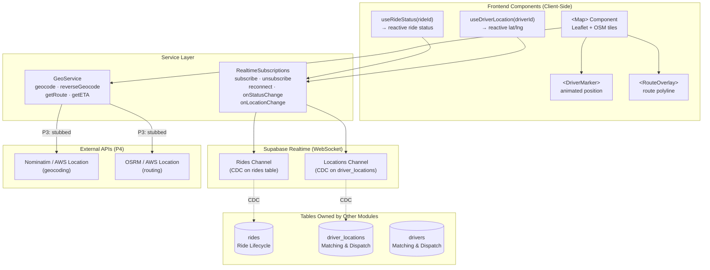
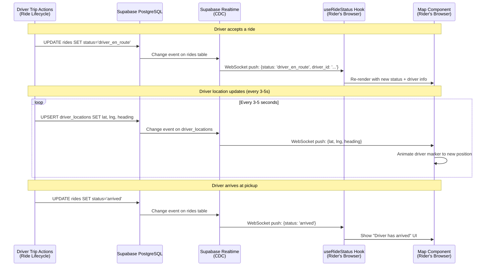
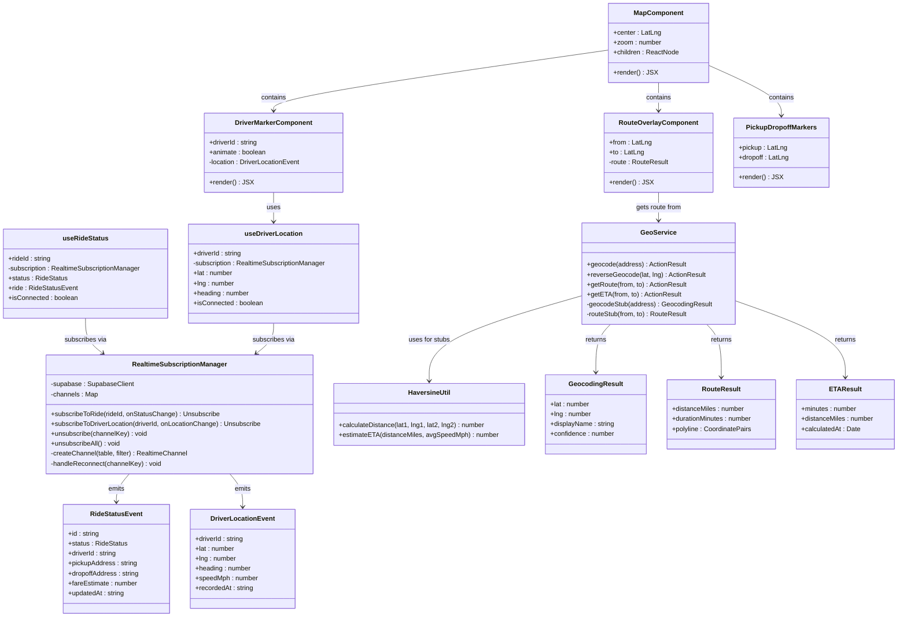

# Module 4: Real-Time & Location

## 1. Module Features

### What This Module Does

The Real-Time & Location module handles all live, time-sensitive communication in Ultra — streaming ride status changes to riders, broadcasting driver GPS positions, integrating interactive maps, and calculating routes and ETAs. This module owns **no database tables**. It is a pure read-and-broadcast layer that subscribes to changes in tables owned by other modules and pushes updates to connected frontend clients via Supabase Realtime.

**Ride Status Streaming (US13–US16):**
- Subscribe to `rides` table changes and broadcast status transitions to the rider's connected browser session
- Support all tracking screens: matching/searching (US13), driver en route (US14), driver arrived (US15), ride in progress (US16)
- Deliver status updates within 1–2 seconds of the database write
- Handle WebSocket reconnection gracefully — clients automatically re-subscribe on connection loss

**Driver Location Broadcasting (US08):**
- Subscribe to `driver_locations` table changes and forward position updates to the assigned rider
- Broadcast driver lat/lng/heading to the ride-tracking map in real time
- Throttle broadcasts to every 3–5 seconds (sufficient for 15 drivers at our scale)
- Support multiple concurrent subscribers per ride (rider + trip share viewers)

**Interactive Maps:**
- Render interactive maps using Leaflet.js with OpenStreetMap tile layers
- Provide a reusable `<Map>` React component that other modules' pages embed
- Display pickup and dropoff markers
- Display the driver's live-updating position marker with heading indicator
- Display the route polyline between pickup and dropoff

**Geocoding & Routing:**
- Convert address text to lat/lng coordinates using Nominatim (free, OpenStreetMap-based) — stubbed in P3 with hardcoded Memphis, TN coordinates
- Calculate driving routes between two points using OSRM — stubbed in P3 with straight-line distance
- Estimate trip ETA from route distance and average speed — stubbed in P3 with Haversine + 25 mph average
- In P4: option to upgrade to AWS Location Service (free tier: 500K requests/month)

### What This Module Does NOT Do

- Does not own any database tables — reads from `rides`, `drivers`, and `driver_locations` owned by other modules
- Does not write ride status transitions — the Ride Lifecycle module does that
- Does not write driver locations — the Matching & Dispatch module does that
- Does not implement the matching algorithm — the Matching & Dispatch module does that
- Does not handle payments or notifications — those are separate modules
- Does not persist historical location trails — only the latest position matters

---

## 2. Module Architecture

### Text Description

This module is architecturally unique: it has no data layer of its own. It acts as a **real-time bridge** between database state changes (written by other modules) and connected frontend clients.

**Presentation Layer:** React components and custom hooks that pages from other modules embed:
- `<Map>` — Leaflet map component with OpenStreetMap tiles
- `<DriverMarker>` — animated marker showing driver position and heading
- `<RouteOverlay>` — polyline showing the driving route
- `useRideStatus(rideId)` — hook that subscribes to ride status changes
- `useDriverLocation(driverId)` — hook that subscribes to driver position updates

**Service Layer:** Two utility modules:
- `RealtimeSubscriptions` — manages Supabase Realtime channel subscriptions, handles reconnection, and provides typed event callbacks
- `GeoService` — geocoding (address → coordinates), reverse geocoding (coordinates → address), route calculation, and ETA estimation. Stubbed in P3, real API calls in P4.

**Data Layer:** None. This module reads from:
- `rides` table (owned by Ride Lifecycle) — subscribes to row changes via Supabase Realtime
- `driver_locations` table (owned by Matching & Dispatch) — subscribes to row changes via Supabase Realtime
- `drivers` table (owned by Matching & Dispatch) — one-time reads for driver display info

**Design Justification:** Supabase Realtime is the right choice for our scale. It provides built-in PostgreSQL change data capture (CDC) — when any module writes to the `rides` or `driver_locations` table, Supabase automatically pushes the change to all subscribed clients over WebSocket. This means we don't need to build our own WebSocket server, manage connection pools, or implement a pub/sub layer. For 30 riders and 15 drivers, Supabase's free tier handles the WebSocket connection count (max 200 concurrent connections on free tier, we need ~48 worst case). The client-side hooks abstract away reconnection logic and provide a clean React interface — consuming components simply call `useRideStatus(rideId)` and get reactive state updates.

For maps and geocoding, the stub-then-upgrade pattern keeps P3 moving without external dependencies while preserving the API surface for P4 integration. The `GeoService` is a thin adapter — swapping Nominatim for AWS Location Service in P4 only changes the implementation of two functions, not the callers.

### Mermaid Architecture Diagram



### Realtime Data Flow



---

## 3. Data Storage

**This module owns no database tables.**

It reads from tables owned by other modules via Supabase Realtime subscriptions:

| Table | Owned By | How This Module Uses It |
|-------|----------|------------------------|
| `rides` | Ride Lifecycle | Subscribes to CDC for status changes |
| `driver_locations` | Matching & Dispatch | Subscribes to CDC for position updates |
| `drivers` | Matching & Dispatch | One-time reads for driver display info |

All data persistence is handled by the modules that own these tables. This module's state is ephemeral — it exists only in the WebSocket connection and React component state on the client.

---

## 4. Data Schemas

This module defines no database schemas. It consumes the schemas defined by:
- Ride Lifecycle module (`rides` table — see Module 2)
- Matching & Dispatch module (`drivers`, `driver_locations` tables — see Module 3)

### TypeScript Types Consumed

```typescript
// From Ride Lifecycle module
interface RideStatusEvent {
    id: string;
    status: RideStatus;
    driver_id: string | null;
    pickup_address: string;
    dropoff_address: string;
    fare_estimate: number | null;
    matched_at: string | null;
    driver_arrived_at: string | null;
    pickup_at: string | null;
    updated_at: string;
}

// From Matching & Dispatch module
interface DriverLocationEvent {
    driver_id: string;
    lat: number;
    lng: number;
    heading: number | null;
    speed_mph: number | null;
    recorded_at: string;
}
```

### TypeScript Types Defined by This Module

```typescript
interface GeocodingResult {
    lat: number;
    lng: number;
    displayName: string;
    confidence: number;
}

interface RouteResult {
    distanceMiles: number;
    durationMinutes: number;
    polyline: [number, number][];  // Array of [lat, lng] pairs
}

interface ETAResult {
    minutes: number;
    distanceMiles: number;
    calculatedAt: Date;
}
```

---

## 5. Module API

This module's API is entirely client-side (React hooks and components) plus one server-side utility service.

### React Hooks (Client-Side)

| Hook | Input | Returns | Purpose |
|------|-------|---------|---------|
| `useRideStatus(rideId)` | `rideId: string` | `{ status: RideStatus, ride: RideStatusEvent, isConnected: boolean }` | Subscribe to ride status changes |
| `useDriverLocation(driverId)` | `driverId: string` | `{ lat: number, lng: number, heading: number, isConnected: boolean }` | Subscribe to driver position updates |

### React Components (Client-Side)

| Component | Props | Purpose |
|-----------|-------|---------|
| `<Map>` | `center: [lat, lng], zoom: number, children: ReactNode` | Leaflet map with OSM tiles |
| `<DriverMarker>` | `driverId: string, animate: boolean` | Live-updating driver position marker |
| `<RouteOverlay>` | `from: [lat, lng], to: [lat, lng]` | Route polyline between two points |
| `<PickupDropoffMarkers>` | `pickup: [lat, lng], dropoff: [lat, lng]` | Static markers for pickup and dropoff |

### GeoService (Server-Side Utility)

| Function | Input | Output | Notes |
|----------|-------|--------|-------|
| `geocode(address)` | `{ address: string }` | `ActionResult<GeocodingResult>` | P3: stubbed with Memphis coords |
| `reverseGeocode(lat, lng)` | `{ lat: number, lng: number }` | `ActionResult<string>` | P3: stubbed |
| `getRoute(from, to)` | `{ from: [lat, lng], to: [lat, lng] }` | `ActionResult<RouteResult>` | P3: straight-line distance |
| `getETA(from, to)` | `{ from: [lat, lng], to: [lat, lng] }` | `ActionResult<ETAResult>` | P3: Haversine + 25mph avg |

---

## 6. Class Diagram



---

## 7. Module Implementation

### GitHub Issues

- **#27** — Set up Supabase Realtime for ride status updates (US13–US16)
- **#28** — Live driver location broadcasting (US08)
- **#29** — Integrate Leaflet maps with real geocoding

### File Structure

```
src/features/
└── realtime/
    ├── subscription-manager.ts        # RealtimeSubscriptionManager — channel lifecycle
    ├── hooks/
    │   ├── useRideStatus.ts           # Hook: subscribe to ride status changes
    │   └── useDriverLocation.ts       # Hook: subscribe to driver location updates
    ├── components/
    │   ├── Map.tsx                    # Leaflet map with OSM tiles ('use client')
    │   ├── DriverMarker.tsx           # Animated driver position marker
    │   ├── RouteOverlay.tsx           # Route polyline component
    │   └── PickupDropoffMarkers.tsx   # Static pickup/dropoff markers
    ├── geo-service.ts                 # Geocoding, routing, ETA (stubbed in P3)
    ├── types.ts                       # RideStatusEvent, DriverLocationEvent, GeocodingResult, etc.
    └── __tests__/
        ├── subscription-manager.test.ts
        ├── geo-service.test.ts
        └── hooks.test.ts
```
