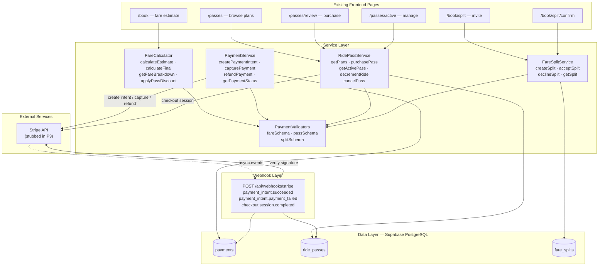
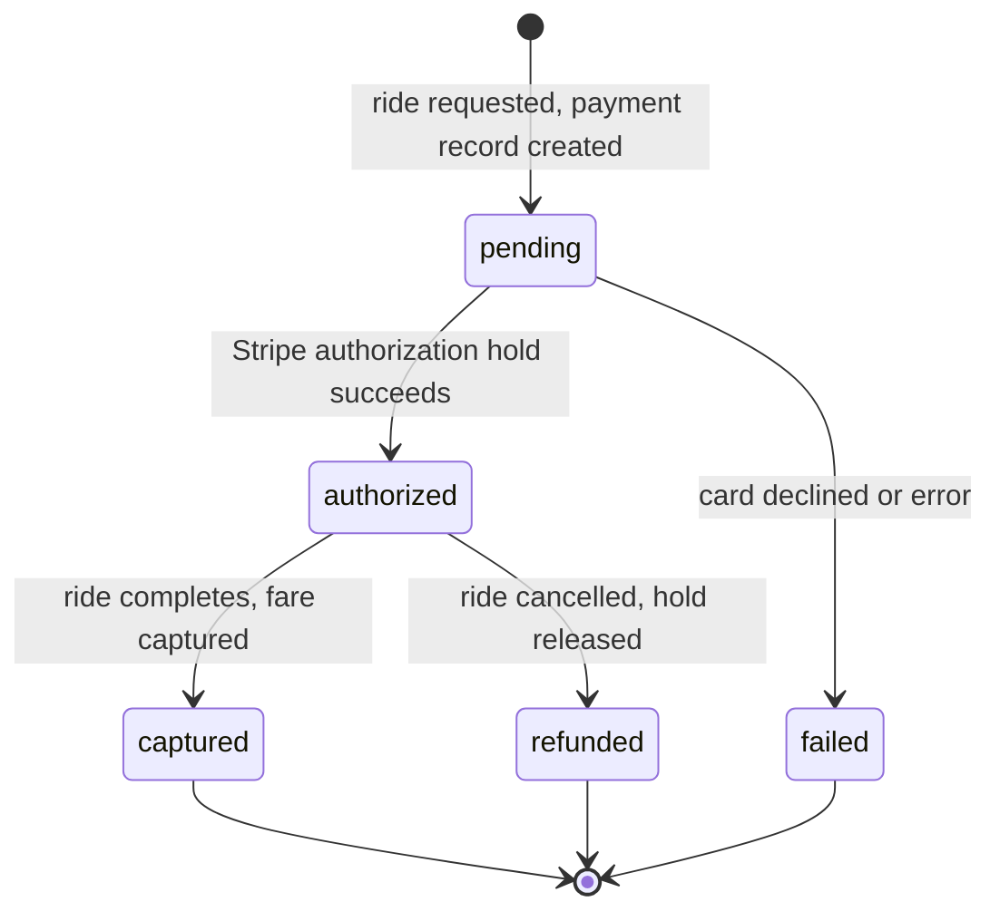
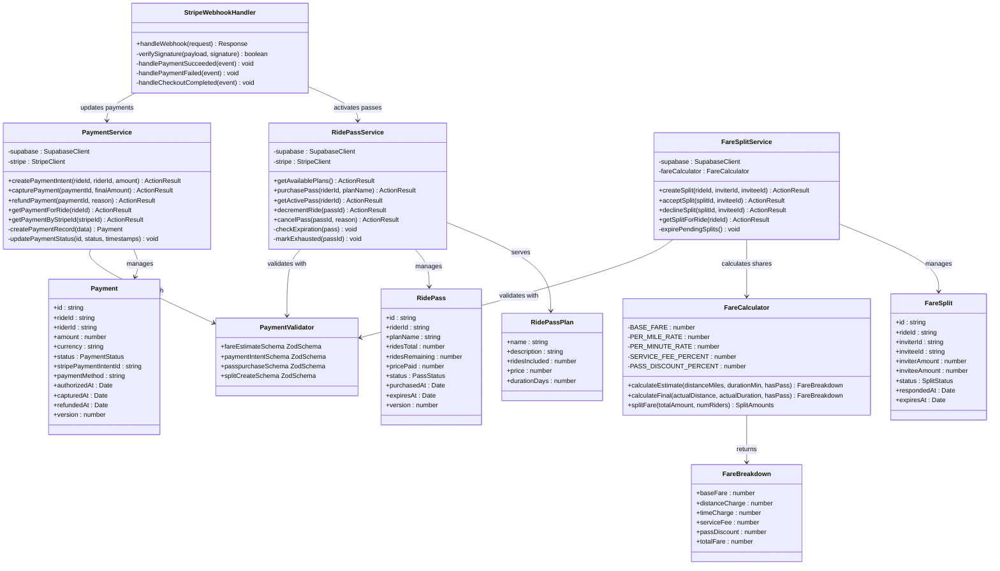

# Module 5: Payments & Pricing

> **Architecture update (post issue #31 rescope):** Stripe integration uses **Stripe Elements** (embedded iframes inside Ultra pages), not **Stripe Checkout** (hosted redirect). See [`documentation/stripe-payments.md`](../stripe-payments.md) for the full Elements architecture, Stripe Customer lifecycle (lazy creation on first saved card), Payment Intent vs Setup Intent usage, and the related issue breakdown (#31–#38). Any references below to "Stripe Checkout session" are superseded — ride pass purchases, ride fare capture, and fare split invitee payment all use Payment Element inline on existing Ultra pages.

## 1. Module Features

### What This Module Does

The Payments & Pricing module handles all financial transactions in Ultra — fare calculation, Stripe payment processing, ride pass subscriptions, and fare splitting. It owns the `payments`, `ride_passes`, and `fare_splits` tables from Layer 4.

**Fare Calculation:**
- Calculate fare estimates at ride creation time based on distance and estimated duration
- Calculate final fares at ride completion with actual distance and time
- Apply a transparent fare breakdown: base fare + per-mile rate + per-minute rate + service fee
- Apply ride pass discounts when the rider has an active pass with remaining rides
- Split fare calculations between two riders for shared rides

**Stripe Payment Processing (US05, US06):**
- Create an authorization hold (Payment Intent) when a ride is requested — rider's card is authorized but not charged
- Capture the final fare amount when the ride completes
- Process refunds when a ride is cancelled before completion
- Handle payment failures gracefully with retry logic and user notification
- Expose a Stripe webhook endpoint (`/api/webhooks/stripe`) to receive asynchronous payment events
- All payment operations use Stripe test mode in P3; real Stripe test mode cards in P4

**Ride Passes (US05):**
- List available ride pass plans (e.g., "10 rides for $89", "20 rides for $159")
- Purchase a ride pass via Stripe Checkout session
- Track rides remaining on an active pass
- Decrement pass ride count when a pass-eligible ride completes
- Auto-expire passes when they reach their expiration date
- Cancel a pass with optional pro-rated refund

**Fare Splitting (US06):**
- Create a fare split invitation from one rider to another for a specific ride
- Accept or decline a split invitation
- Auto-expire pending invitations after a configured timeout
- Calculate each rider's share (currently 50/50 even split)
- Process separate payment captures for each rider's share

### What This Module Does NOT Do

- Does not manage ride state transitions — delegates to Ride Lifecycle
- Does not authenticate users — delegates to Auth & Identity
- Does not store rider or driver profiles — reads from Auth & Identity and Matching & Dispatch
- Does not send payment confirmation notifications — delegates to Safety & Notifications
- Does not handle real-time updates — Ride Lifecycle writes status; Real-Time broadcasts it
- Does not manage driver payouts or Stripe Connect accounts (out of scope for MVP)

---

## 2. Module Architecture

### Text Description

The module is structured around three services that each manage a distinct financial concern:

**Presentation Layer:** This module serves existing frontend pages through server actions. Rider pages (`/book`, `/passes`, `/passes/review`, `/passes/active`, `/book/split`, `/book/split/confirm`) call pricing and payment actions. One Route Handler exists for the Stripe webhook endpoint.

**Service Layer:** Three services:
- `FareCalculator` — Pure calculation logic. Takes distance and duration, applies rate tables, returns a fare breakdown. No side effects, no database access. Trivially unit-testable.
- `PaymentService` — Manages the payment lifecycle: create intent, capture, refund. Wraps the Stripe SDK. In P3, all Stripe calls are stubbed to return mock payment intent IDs. In P4, connects to Stripe test mode.
- `RidePassService` — Manages pass purchase, ride deduction, and expiration. Interacts with both Supabase (pass records) and Stripe (checkout sessions for purchase).
- `FareSplitService` — Manages split invitations, acceptance, and per-rider payment capture.

**Data Layer:** Three tables in Layer 4:
- `payments` — one record per payment attempt, tracks the full Stripe lifecycle (authorized → captured → refunded)
- `ride_passes` — one record per purchased pass with rides remaining and expiration
- `fare_splits` — one record per split invitation with status tracking

**Webhook Layer:** A Next.js Route Handler at `/api/webhooks/stripe` receives Stripe events (payment confirmation, failure, refund) and updates the `payments` table accordingly. This is the only REST endpoint in the module — everything else uses server actions.

**Design Justification:** Separating `FareCalculator` as a pure function (no I/O, no side effects) makes fare logic completely deterministic and unit-testable — we can verify every rate calculation without mocking Stripe or Supabase. The stub pattern for Stripe calls (return mock IDs in P3, real API in P4) lets the team build and test the full payment flow end-to-end without a Stripe account. The webhook handler is a Route Handler (not a server action) because Stripe sends HTTP POST requests to a URL — it cannot call a Next.js server action. The authorization-then-capture pattern (rather than immediate charge) protects riders from overcharges: if a ride is cancelled, we simply release the hold instead of processing a refund, which avoids temporary balance reductions on the rider's bank statement.

### Mermaid Architecture Diagram



### Payment Lifecycle



---

## 3. Data Storage

| Layer | Table | Purpose | Persistence |
|-------|-------|---------|-------------|
| L4 | `payments` | Payment lifecycle records (one per ride payment attempt) | Durable — PostgreSQL |
| L4 | `ride_passes` | Subscription pass records with ride counts | Durable — PostgreSQL |
| L4 | `fare_splits` | Split invitations and acceptance status | Durable — PostgreSQL |

All financial data is durably stored in PostgreSQL. No in-memory caches for payment state — a server crash must not lose payment records. The `version` column on `payments` and `ride_passes` prevents race conditions on concurrent updates (e.g., two simultaneous ride completions both trying to capture the same payment).

---

## 4. Data Schemas

### `payments`

```sql
CREATE TABLE public.payments (
    id                          UUID PRIMARY KEY DEFAULT gen_random_uuid(),
    ride_id                     UUID NOT NULL REFERENCES public.rides(id),
    rider_id                    UUID NOT NULL REFERENCES public.riders(id),
    amount                      NUMERIC(10,2) NOT NULL,
    currency                    TEXT NOT NULL DEFAULT 'usd',
    status                      TEXT NOT NULL DEFAULT 'pending'
                                CHECK (status IN ('pending','authorized','captured','refunded','failed')),
    stripe_payment_intent_id    TEXT,
    stripe_charge_id            TEXT,
    payment_method              TEXT DEFAULT 'card'
                                CHECK (payment_method IN ('card','ride_pass','split')),
    failure_reason              TEXT,
    authorized_at               TIMESTAMPTZ,
    captured_at                 TIMESTAMPTZ,
    refunded_at                 TIMESTAMPTZ,
    failed_at                   TIMESTAMPTZ,
    created_by                  UUID REFERENCES auth.users(id),
    updated_by                  UUID REFERENCES auth.users(id),
    created_at                  TIMESTAMPTZ NOT NULL DEFAULT now(),
    updated_at                  TIMESTAMPTZ NOT NULL DEFAULT now(),
    deleted_at                  TIMESTAMPTZ,
    version                     INT NOT NULL DEFAULT 1
);

CREATE INDEX idx_payments_ride_id ON public.payments(ride_id);
CREATE INDEX idx_payments_rider_id ON public.payments(rider_id);
CREATE INDEX idx_payments_status ON public.payments(status);
CREATE INDEX idx_payments_stripe_pi ON public.payments(stripe_payment_intent_id) WHERE stripe_payment_intent_id IS NOT NULL;

ALTER TABLE public.payments ENABLE ROW LEVEL SECURITY;

CREATE POLICY "Riders read own payments" ON public.payments FOR SELECT
    USING (rider_id IN (SELECT id FROM public.riders WHERE user_id = auth.uid()));

CREATE POLICY "Admins read all payments" ON public.payments FOR SELECT
    USING (EXISTS (
        SELECT 1 FROM public.user_roles WHERE user_id = auth.uid() AND role = 'admin'
    ));

CREATE POLICY "Service role full access" ON public.payments FOR ALL
    USING (auth.jwt()->>'role' = 'service_role')
    WITH CHECK (auth.jwt()->>'role' = 'service_role');
```

### `ride_passes`

```sql
CREATE TABLE public.ride_passes (
    id                      UUID PRIMARY KEY DEFAULT gen_random_uuid(),
    rider_id                UUID NOT NULL REFERENCES public.riders(id),
    plan_name               TEXT NOT NULL,
    plan_description        TEXT,
    rides_total             INT NOT NULL,
    rides_remaining         INT NOT NULL,
    price_paid              NUMERIC(10,2) NOT NULL,
    status                  TEXT NOT NULL DEFAULT 'active'
                            CHECK (status IN ('active','expired','cancelled','exhausted')),
    stripe_subscription_id  TEXT,
    purchased_at            TIMESTAMPTZ NOT NULL DEFAULT now(),
    expires_at              TIMESTAMPTZ NOT NULL,
    cancelled_at            TIMESTAMPTZ,
    cancellation_reason     TEXT,
    created_by              UUID REFERENCES auth.users(id),
    updated_by              UUID REFERENCES auth.users(id),
    created_at              TIMESTAMPTZ NOT NULL DEFAULT now(),
    updated_at              TIMESTAMPTZ NOT NULL DEFAULT now(),
    deleted_at              TIMESTAMPTZ,
    version                 INT NOT NULL DEFAULT 1
);

CREATE INDEX idx_ride_passes_rider_id ON public.ride_passes(rider_id);
CREATE INDEX idx_ride_passes_status ON public.ride_passes(status);

ALTER TABLE public.ride_passes ENABLE ROW LEVEL SECURITY;

CREATE POLICY "Riders manage own passes" ON public.ride_passes FOR ALL
    USING (rider_id IN (SELECT id FROM public.riders WHERE user_id = auth.uid()))
    WITH CHECK (rider_id IN (SELECT id FROM public.riders WHERE user_id = auth.uid()));

CREATE POLICY "Admins read all passes" ON public.ride_passes FOR SELECT
    USING (EXISTS (
        SELECT 1 FROM public.user_roles WHERE user_id = auth.uid() AND role = 'admin'
    ));
```

### `fare_splits`

```sql
CREATE TABLE public.fare_splits (
    id              UUID PRIMARY KEY DEFAULT gen_random_uuid(),
    ride_id         UUID NOT NULL REFERENCES public.rides(id),
    inviter_id      UUID NOT NULL REFERENCES public.riders(id),
    invitee_id      UUID NOT NULL REFERENCES public.riders(id),
    inviter_amount  NUMERIC(10,2) NOT NULL,
    invitee_amount  NUMERIC(10,2) NOT NULL,
    status          TEXT NOT NULL DEFAULT 'pending'
                    CHECK (status IN ('pending','accepted','declined','expired')),
    responded_at    TIMESTAMPTZ,
    expires_at      TIMESTAMPTZ NOT NULL,
    created_by      UUID REFERENCES auth.users(id),
    updated_by      UUID REFERENCES auth.users(id),
    created_at      TIMESTAMPTZ NOT NULL DEFAULT now(),
    updated_at      TIMESTAMPTZ NOT NULL DEFAULT now()
);

CREATE INDEX idx_fare_splits_ride_id ON public.fare_splits(ride_id);

ALTER TABLE public.fare_splits ENABLE ROW LEVEL SECURITY;

CREATE POLICY "Split participants manage their splits" ON public.fare_splits FOR ALL
    USING (
        inviter_id IN (SELECT id FROM public.riders WHERE user_id = auth.uid())
        OR invitee_id IN (SELECT id FROM public.riders WHERE user_id = auth.uid())
    )
    WITH CHECK (
        inviter_id IN (SELECT id FROM public.riders WHERE user_id = auth.uid())
        OR invitee_id IN (SELECT id FROM public.riders WHERE user_id = auth.uid())
    );
```

---

## 5. Module API

### Fare Calculation Actions

| Action | Input | Output | Auth |
|--------|-------|--------|------|
| `calculateFareEstimate(data)` | `{ distance_miles: number, estimated_duration_min: number, has_active_pass?: boolean }` | `ActionResult<FareBreakdown>` | Rider |
| `calculateFinalFare(data)` | `{ ride_id: string, actual_distance_miles: number, actual_duration_min: number }` | `ActionResult<FareBreakdown>` | Service (internal) |

### Payment Actions

| Action | Input | Output | Auth |
|--------|-------|--------|------|
| `createPaymentIntent(data)` | `{ ride_id: string, amount: number }` | `ActionResult<{ payment_id: string, client_secret: string }>` | Rider |
| `capturePayment(paymentId)` | `{ payment_id: string, final_amount: number }` | `ActionResult<Payment>` | Service (internal) |
| `refundPayment(paymentId)` | `{ payment_id: string, reason?: string }` | `ActionResult<Payment>` | Service (internal) |
| `getPaymentForRide(rideId)` | `{ ride_id: string }` | `ActionResult<Payment>` | Rider |

### Ride Pass Actions

| Action | Input | Output | Auth |
|--------|-------|--------|------|
| `getAvailablePlans()` | — | `ActionResult<RidePassPlan[]>` | Rider |
| `purchasePass(data)` | `{ plan_name: string }` | `ActionResult<{ checkout_url: string }>` | Rider |
| `getActivePass()` | — | `ActionResult<RidePass \| null>` | Rider |
| `decrementPassRide(passId)` | `{ pass_id: string }` | `ActionResult<RidePass>` | Service (internal) |
| `cancelPass(passId)` | `{ pass_id: string, reason?: string }` | `ActionResult<RidePass>` | Rider |

### Fare Split Actions

| Action | Input | Output | Auth |
|--------|-------|--------|------|
| `createFareSplit(data)` | `{ ride_id: string, invitee_id: string }` | `ActionResult<FareSplit>` | Rider |
| `acceptFareSplit(splitId)` | `{ split_id: string }` | `ActionResult<FareSplit>` | Rider (invitee) |
| `declineFareSplit(splitId)` | `{ split_id: string }` | `ActionResult<FareSplit>` | Rider (invitee) |
| `getFareSplitForRide(rideId)` | `{ ride_id: string }` | `ActionResult<FareSplit \| null>` | Rider |

### Webhook Route Handler (REST)

| Endpoint | Method | Purpose |
|----------|--------|---------|
| `/api/webhooks/stripe` | POST | Receives Stripe events: `payment_intent.succeeded`, `payment_intent.payment_failed`, `checkout.session.completed` |

---

## 6. Class Diagram



---

## 7. Module Implementation

### GitHub Issues

- **#14** — Design and create payments and ride passes schema
- **#25** — Ride pass subscription API (US05)
- **#26** — Fare splitting API (US06)
- **#31** — Stripe payment integration — authorize, capture, refund (US05, US06)

### File Structure

```
src/features/
├── payments/
│   ├── actions.ts                  # createPaymentIntent, capturePayment, refundPayment, getPayment
│   ├── fare-calculator.ts          # Pure fare calculation logic (no side effects)
│   ├── validators.ts               # Zod schemas for payment inputs
│   ├── types.ts                    # Payment, FareBreakdown, PaymentStatus
│   ├── stripe-stub.ts              # P3 Stripe stubs (returns mock IDs)
│   └── __tests__/
│       ├── fare-calculator.test.ts
│       └── payments.test.ts
├── ride-pass/
│   ├── actions.ts                  # getPlans, purchasePass, getActivePass, decrementRide, cancelPass
│   ├── plans.ts                    # Static ride pass plan definitions
│   ├── types.ts                    # RidePass, RidePassPlan, PassStatus
│   └── __tests__/
│       └── ride-pass.test.ts
├── fare-split/
│   ├── actions.ts                  # createSplit, acceptSplit, declineSplit, getSplit
│   ├── types.ts                    # FareSplit, SplitStatus
│   └── __tests__/
│       └── fare-split.test.ts
└── app/
    └── api/
        └── webhooks/
            └── stripe/
                └── route.ts        # Stripe webhook handler (POST)
```
