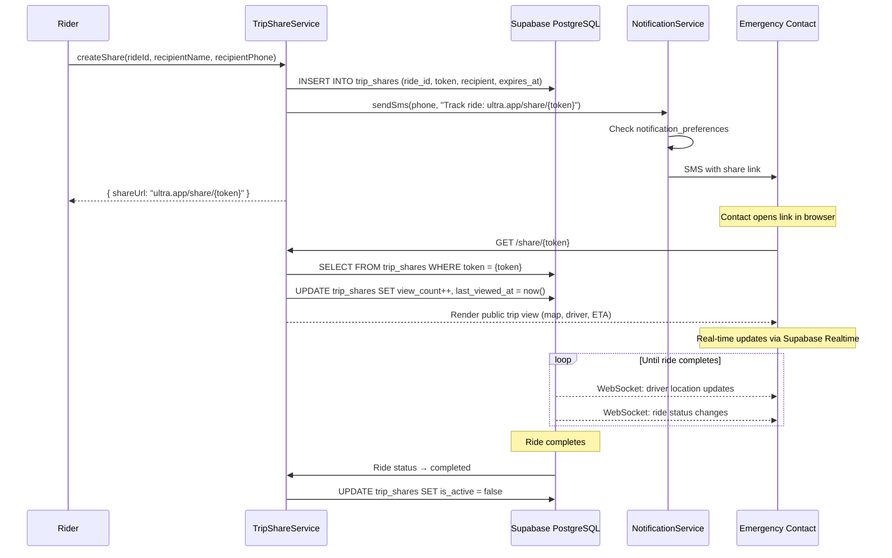
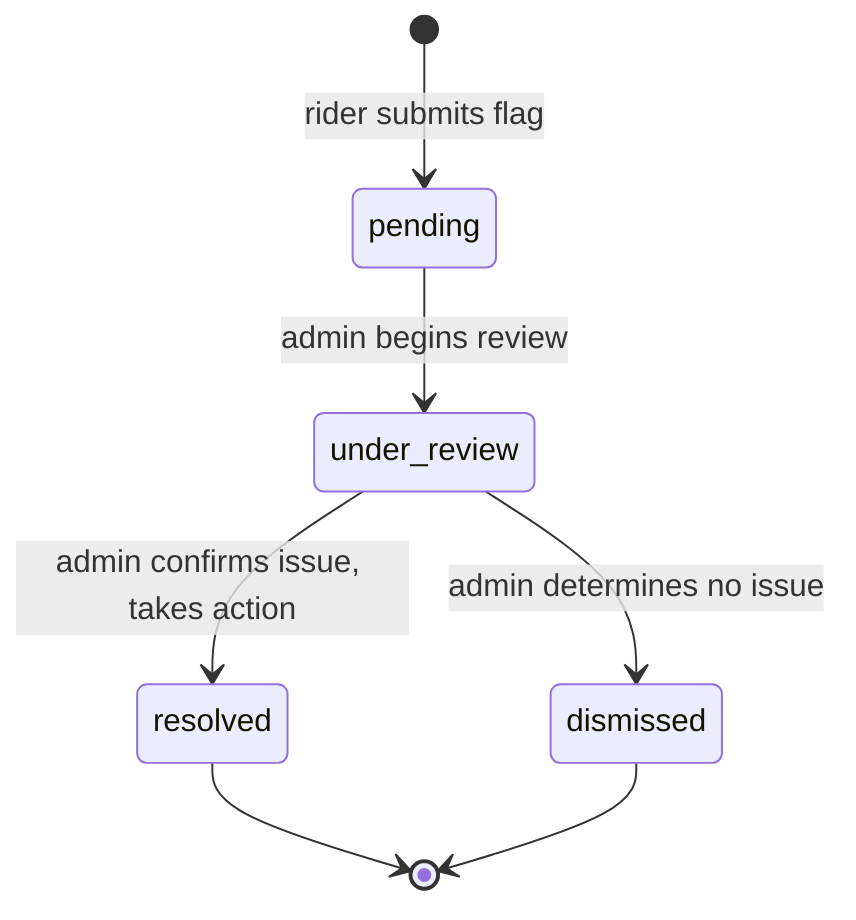

# Module 6: Safety & Notifications

## 1. Module Features

### What This Module Does

The Safety & Notifications module manages Ultra's safety-critical features and all outbound communication — trusted driver management, live trip sharing with emergency contacts, SMS notifications, and driver incident flagging. It owns the `trusted_drivers`, `trip_shares`, and `driver_flags` tables from Layers 2 and 4.

**Trusted Drivers (US03):**
- Allow riders to maintain a list of trusted/preferred drivers
- Add a driver to the trusted list with an optional nickname (e.g., "Maria's regular driver")
- Remove a driver from the trusted list
- Fetch the rider's trusted driver list with full driver details (name, vehicle, rating, child-safe status)
- The Matching & Dispatch module reads this list during driver matching to prefer trusted drivers

**Live Trip Sharing (US04):**
- Generate a unique, tokenized share link for an active ride
- Share link is accessible without authentication — anyone with the token can view the live trip
- Shared view shows: driver info, current location on map, route, and ETA (consumed via Real-Time module hooks)
- Support multiple share links per ride (e.g., share with both parents)
- Track view count and last viewed timestamp for each share
- Auto-expire share tokens when the ride completes
- Optionally send the share link via SMS to the recipient

**SMS Notifications (US09):**
- Send SMS alerts for key ride events: ride confirmed, driver en route, driver arrived, trip completed
- Respect the rider's notification preferences (check `notification_preferences` table owned by Auth & Identity)
- Use AWS SNS (free tier) or Twilio for SMS delivery
- In P3: stub all SMS sending — log to console instead of sending real messages
- In P4: integrate real SMS provider with AWS credits
- Support notification templates with variable substitution (driver name, ETA, etc.)

**Ride PIN Verification (US03):**
- When a parent books a child ride, they set a 4-digit PIN that the driver must verify before starting the trip
- The parent receives the PIN in the booking confirmation; the driver sees a PIN entry screen at pickup
- `setRidePin()` — called during ride creation when `is_child_safe_required` is true; stores a hashed PIN on the ride
- `verifyRidePin()` — called by the driver at pickup; compares the entered PIN against the stored hash
- PIN verification must succeed before the Ride Lifecycle module allows the `arrived → in_progress` transition
- Failed PIN attempts are logged; after 3 failures the ride is flagged for admin review
- Corresponds to `POST /api/safety/pin/verify` from the architecture doc

**Driver Flagging (US07):**
- Allow riders to flag/report a driver after a ride (safety concern, behavior issue, vehicle condition)
- Store the flag with a reason category, free-text details, and the related ride
- Flags default to `pending` status for admin review
- Admins can review, add notes, and resolve/dismiss flags
- Track which admin reviewed each flag and when

### What This Module Does NOT Do

- Does not manage rider or driver profiles — owned by Auth & Identity and Matching & Dispatch
- Does not manage ride state transitions — owned by Ride Lifecycle
- Does not process payments — owned by Payments & Pricing
- Does not stream real-time data — the shared trip view embeds Real-Time module components
- Does not implement the matching algorithm — the Matching module reads trusted drivers from this module's table
- Does not handle email notifications (out of scope for MVP)
- Does not handle push notifications (out of scope for MVP — SMS only)

---

## 2. Module Architecture

### Text Description

The Safety & Notifications module is structured around five services, each handling a distinct safety or communication concern:

**Presentation Layer:** This module serves several existing frontend pages:
- `/safety/trusted-drivers` — manage trusted driver list
- `/share/[token]` — public trip share view (no auth required)
- `/profile/safety` — safety preferences
- `/profile/notifications` — notification preference toggles (writes to Auth & Identity's table)
- The driver flagging UI is embedded in the ride completion flow (`/ride/[id]/complete`)
- The PIN entry screen is embedded in the driver pickup flow (`/trip/[id]/pickup`)

**Service Layer:** Five services:
- `TrustedDriverService` — CRUD for the trusted drivers list. Simple read/write operations. The matching module calls this service's data at match time.
- `TripShareService` — Token generation, share link lifecycle, view tracking. Generates cryptographically secure tokens using `crypto.randomUUID()`. Manages expiration based on ride status.
- `NotificationService` — Sends SMS messages via a provider adapter. Uses a strategy pattern: `SmsStub` in P3 (logs to console), `AwsSnsAdapter` or `TwilioAdapter` in P4. Checks notification preferences before sending.
- `DriverFlagService` — Creates flag records, manages admin review workflow (pending → under_review → resolved/dismissed).
- `RideVerificationService` — Manages the PIN verification flow for child rides (US03). When a parent books a child-safe ride, `setRidePin()` hashes and stores a 4-digit PIN on the `rides` table (via a `pin_hash` column). At pickup, the driver calls `verifyRidePin()` which compares the entered PIN against the stored hash. The Ride Lifecycle module gates the `arrived → in_progress` transition on successful verification. Failed attempts are counted; 3 failures auto-flag the ride for admin review. Corresponds to `POST /api/safety/pin/verify` in the architecture doc.

**Data Layer:** Three tables owned, plus one column on a cross-module table:
- `trusted_drivers` (Layer 2) — simple junction table between riders and drivers
- `trip_shares` (Layer 4) — share tokens with expiration and view tracking
- `driver_flags` (Layer 4) — incident reports with admin review workflow
- `rides.pin_hash` and `rides.pin_attempts` columns (owned by Ride Lifecycle, written by this module via service role)

The module also reads `notification_preferences` (owned by Auth & Identity) to check whether a rider has SMS enabled before sending.

**Design Justification:** The strategy pattern for SMS delivery (stub in P3, real provider in P4) is the right approach because it lets the entire notification pipeline be built and tested end-to-end without an external service dependency. The only change in P4 is swapping the adapter — no business logic changes. Trip share tokens use UUID v4, which provides 122 bits of entropy — computationally infeasible to guess, and sufficient security for a temporary ride-tracking link. Making the shared trip view public (no auth) is intentional — the whole point is that an emergency contact who doesn't have the Ultra app can still track the ride. The token itself serves as the access credential.

### Mermaid Architecture Diagram

```mermaid
graph TB
    subgraph Presentation["Existing Frontend Pages"]
        TD["/safety/trusted-drivers"]
        SV["/share/[token]<br/>(public, no auth)"]
        PS["/profile/safety"]
        PN["/profile/notifications"]
        RC["/ride/[id]/complete<br/>(flag driver UI)"]
        AD["/admin — flag review"]
    end

    subgraph Service["Service Layer"]
        TDS[TrustedDriverService<br/>getTrustedDrivers<br/>addTrustedDriver<br/>removeTrustedDriver]
        TSS[TripShareService<br/>createShare · getShareByToken<br/>deactivateSharesForRide<br/>trackView]
        NS[NotificationService<br/>sendRideConfirmed<br/>sendDriverEnRoute<br/>sendDriverArrived<br/>sendTripCompleted]
        DFS[DriverFlagService<br/>createFlag · getFlags<br/>reviewFlag · resolveFlag]
        SMA[SmsAdapter<br/>«interface»<br/>sendSms(to, body)]
        STUB[SmsStub<br/>logs to console]
        REAL[AwsSnsAdapter / TwilioAdapter<br/>sends real SMS]
        SV2[SafetyValidators<br/>trustedDriverSchema<br/>tripShareSchema<br/>driverFlagSchema]
    end

    subgraph Data["Data Layer — Supabase PostgreSQL"]
        TDT[(trusted_drivers)]
        TST[(trip_shares)]
        DFT[(driver_flags)]
        NPT[(notification_preferences<br/>READ ONLY — Auth module)]
    end

    subgraph External["External Services (P4)"]
        SMS["AWS SNS / Twilio"]
    end

    TD --> TDS
    SV --> TSS
    PS --> TDS
    RC --> DFS
    AD --> DFS

    TDS --> SV2
    TSS --> SV2
    DFS --> SV2

    NS --> SMA
    SMA <|-- STUB
    SMA <|-- REAL
    REAL --> SMS

    TDS --> TDT
    TSS --> TST
    DFS --> DFT
    NS -.->|check prefs| NPT
```

### Trip Share Flow



### Driver Flag Review Workflow



---

## 3. Data Storage

| Layer | Table | Purpose | Persistence |
|-------|-------|---------|-------------|
| L2 | `trusted_drivers` | Junction table: rider ↔ trusted driver relationships | Durable — PostgreSQL |
| L4 | `trip_shares` | Tokenized share links with view tracking | Durable — PostgreSQL |
| L4 | `driver_flags` | Incident reports with admin review workflow | Durable — PostgreSQL |

This module also reads (but does not write) `notification_preferences` owned by Auth & Identity.

SMS delivery is fire-and-forget — no persistent record of sent messages is stored in our database. If SMS delivery logging is needed in the future, it can be added as a `notification_log` table.

---

## 4. Data Schemas

### `trusted_drivers`

```sql
CREATE TABLE public.trusted_drivers (
    id          UUID PRIMARY KEY DEFAULT gen_random_uuid(),
    rider_id    UUID NOT NULL REFERENCES public.riders(id) ON DELETE CASCADE,
    driver_id   UUID NOT NULL REFERENCES public.drivers(id) ON DELETE CASCADE,
    nickname    TEXT,
    created_by  UUID REFERENCES auth.users(id),
    created_at  TIMESTAMPTZ NOT NULL DEFAULT now(),
    updated_at  TIMESTAMPTZ NOT NULL DEFAULT now(),
    deleted_at  TIMESTAMPTZ,
    UNIQUE(rider_id, driver_id)
);

CREATE INDEX idx_trusted_drivers_rider_id ON public.trusted_drivers(rider_id);

ALTER TABLE public.trusted_drivers ENABLE ROW LEVEL SECURITY;

CREATE POLICY "Riders manage own trusted drivers" ON public.trusted_drivers FOR ALL
    USING (rider_id IN (SELECT id FROM public.riders WHERE user_id = auth.uid()))
    WITH CHECK (rider_id IN (SELECT id FROM public.riders WHERE user_id = auth.uid()));

CREATE POLICY "Service role read for matching" ON public.trusted_drivers FOR SELECT
    USING (auth.jwt()->>'role' = 'service_role');
```

### `trip_shares`

```sql
CREATE TABLE public.trip_shares (
    id              UUID PRIMARY KEY DEFAULT gen_random_uuid(),
    ride_id         UUID NOT NULL REFERENCES public.rides(id) ON DELETE CASCADE,
    share_token     TEXT NOT NULL UNIQUE,
    recipient_name  TEXT NOT NULL,
    recipient_phone TEXT,
    recipient_email TEXT,
    is_active       BOOLEAN NOT NULL DEFAULT true,
    view_count      INT NOT NULL DEFAULT 0,
    last_viewed_at  TIMESTAMPTZ,
    expires_at      TIMESTAMPTZ NOT NULL,
    created_by      UUID REFERENCES auth.users(id),
    created_at      TIMESTAMPTZ NOT NULL DEFAULT now(),
    updated_at      TIMESTAMPTZ NOT NULL DEFAULT now()
);

CREATE INDEX idx_trip_shares_ride_id ON public.trip_shares(ride_id);
CREATE INDEX idx_trip_shares_token ON public.trip_shares(share_token);

ALTER TABLE public.trip_shares ENABLE ROW LEVEL SECURITY;

-- Riders manage shares for their own rides
CREATE POLICY "Riders manage own trip shares" ON public.trip_shares FOR ALL
    USING (EXISTS (
        SELECT 1 FROM public.rides
        JOIN public.riders ON riders.id = rides.rider_id
        WHERE rides.id = trip_shares.ride_id AND riders.user_id = auth.uid()
    ))
    WITH CHECK (EXISTS (
        SELECT 1 FROM public.rides
        JOIN public.riders ON riders.id = rides.rider_id
        WHERE rides.id = trip_shares.ride_id AND riders.user_id = auth.uid()
    ));

-- Public read access via share token (for the /share/[token] page)
-- This is handled by the service role client in the server action,
-- not by RLS, since the viewer is unauthenticated.
CREATE POLICY "Service role full access" ON public.trip_shares FOR ALL
    USING (auth.jwt()->>'role' = 'service_role')
    WITH CHECK (auth.jwt()->>'role' = 'service_role');
```

### `driver_flags`

```sql
CREATE TABLE public.driver_flags (
    id              UUID PRIMARY KEY DEFAULT gen_random_uuid(),
    driver_id       UUID NOT NULL REFERENCES public.drivers(id),
    reporter_id     UUID NOT NULL REFERENCES public.riders(id),
    ride_id         UUID REFERENCES public.rides(id),
    reason          TEXT NOT NULL CHECK (reason IN ('safety','behavior','vehicle','other')),
    details         TEXT,
    status          TEXT NOT NULL DEFAULT 'pending'
                    CHECK (status IN ('pending','under_review','resolved','dismissed')),
    admin_notes     TEXT,
    reviewed_by     UUID REFERENCES auth.users(id),
    reviewed_at     TIMESTAMPTZ,
    resolved_at     TIMESTAMPTZ,
    created_by      UUID REFERENCES auth.users(id),
    updated_by      UUID REFERENCES auth.users(id),
    created_at      TIMESTAMPTZ NOT NULL DEFAULT now(),
    updated_at      TIMESTAMPTZ NOT NULL DEFAULT now()
);

CREATE INDEX idx_driver_flags_driver_id ON public.driver_flags(driver_id);
CREATE INDEX idx_driver_flags_status ON public.driver_flags(status);

ALTER TABLE public.driver_flags ENABLE ROW LEVEL SECURITY;

CREATE POLICY "Riders create flags" ON public.driver_flags FOR INSERT
    WITH CHECK (reporter_id IN (SELECT id FROM public.riders WHERE user_id = auth.uid()));

CREATE POLICY "Riders read own flags" ON public.driver_flags FOR SELECT
    USING (reporter_id IN (SELECT id FROM public.riders WHERE user_id = auth.uid()));

CREATE POLICY "Admins manage all flags" ON public.driver_flags FOR ALL
    USING (EXISTS (
        SELECT 1 FROM public.user_roles WHERE user_id = auth.uid() AND role = 'admin'
    ))
    WITH CHECK (EXISTS (
        SELECT 1 FROM public.user_roles WHERE user_id = auth.uid() AND role = 'admin'
    ));
```

---

## 5. Module API

### Trusted Driver Actions

| Action | Input | Output | Auth |
|--------|-------|--------|------|
| `getTrustedDrivers()` | — | `ActionResult<TrustedDriverWithDetails[]>` | Rider |
| `addTrustedDriver(data)` | `{ driver_id: string, nickname?: string }` | `ActionResult<TrustedDriver>` | Rider |
| `removeTrustedDriver(id)` | `{ id: string }` | `ActionResult<void>` | Rider |

### Trip Share Actions

| Action | Input | Output | Auth |
|--------|-------|--------|------|
| `createTripShare(data)` | `{ ride_id: string, recipient_name: string, recipient_phone?: string }` | `ActionResult<{ share_url: string }>` | Rider |
| `getShareByToken(token)` | `{ token: string }` | `ActionResult<TripShareView>` | None (public) |
| `deactivateSharesForRide(rideId)` | `{ ride_id: string }` | `ActionResult<void>` | Service (internal) |
| `getSharesForRide(rideId)` | `{ ride_id: string }` | `ActionResult<TripShare[]>` | Rider |

### Notification Actions (internal — called by other modules)

| Action | Input | Output | Notes |
|--------|-------|--------|-------|
| `sendRideConfirmed(riderId, rideDetails)` | `{ rider_id, pickup_address, scheduled_for }` | `void` | Checks prefs before sending |
| `sendDriverEnRoute(riderId, driverName, eta)` | `{ rider_id, driver_name, eta_minutes }` | `void` | |
| `sendDriverArrived(riderId, driverName, vehicle)` | `{ rider_id, driver_name, vehicle_description }` | `void` | |
| `sendTripCompleted(riderId, fareAmount)` | `{ rider_id, fare_amount }` | `void` | |

### Ride PIN Verification Actions (US03)

| Action | Input | Output | Auth |
|--------|-------|--------|------|
| `setRidePin(data)` | `{ ride_id: string, pin: string (4 digits) }` | `ActionResult<void>` | Rider |
| `verifyRidePin(data)` | `{ ride_id: string, pin: string }` | `ActionResult<{ verified: boolean, attempts_remaining: number }>` | Driver |

**REST Route Handler (corresponds to architecture doc):**

| Endpoint | Method | Purpose | Auth |
|----------|--------|---------|------|
| `/api/safety/pin/verify` | POST | Verify driver-entered PIN against stored hash for child ride | Driver |

### Driver Flag Actions

| Action | Input | Output | Auth |
|--------|-------|--------|------|
| `createDriverFlag(data)` | `{ driver_id: string, ride_id?: string, reason: string, details?: string }` | `ActionResult<DriverFlag>` | Rider |
| `getDriverFlags(params)` | `{ page, pageSize, status?, driver_id? }` | `ActionResult<PaginatedResult<DriverFlag>>` | Admin |
| `reviewFlag(flagId)` | `{ flag_id: string }` | `ActionResult<DriverFlag>` | Admin |
| `resolveFlag(data)` | `{ flag_id: string, admin_notes: string, resolution: 'resolved' \| 'dismissed' }` | `ActionResult<DriverFlag>` | Admin |

---

## 6. Class Diagram

```mermaid
classDiagram
    class TrustedDriverService {
        -supabase : SupabaseClient
        +getTrustedDrivers(riderId) ActionResult
        +addTrustedDriver(riderId, driverId, nickname) ActionResult
        +removeTrustedDriver(riderId, id) ActionResult
        +getTrustedDriverIds(riderId) StringList
    }

    class TripShareService {
        -supabase : SupabaseClient
        -notificationService : NotificationService
        +createShare(rideId, riderId, recipientName, phone) ActionResult
        +getShareByToken(token) ActionResult
        +deactivateSharesForRide(rideId) ActionResult
        +getSharesForRide(rideId) ActionResult
        -generateToken() string
        -trackView(shareId) void
    }

    class NotificationService {
        -supabase : SupabaseClient
        -smsAdapter : SmsAdapter
        +sendRideConfirmed(riderId, details) void
        +sendDriverEnRoute(riderId, driverName, eta) void
        +sendDriverArrived(riderId, driverName, vehicle) void
        +sendTripCompleted(riderId, fareAmount) void
        -getUserPhone(riderId) string
        -checkPreferences(riderId) NotifPrefs
        -formatMessage(template, variables) string
    }

    class SmsAdapter {
        <<interface>>
        +sendSms(to, body) Promise
    }

    class SmsStub {
        +sendSms(to, body) Promise
    }

    class AwsSnsAdapter {
        -snsClient : SNSClient
        +sendSms(to, body) Promise
    }

    class TwilioAdapter {
        -twilioClient : TwilioClient
        +sendSms(to, body) Promise
    }

    class RideVerificationService {
        -supabase : SupabaseClient
        +setRidePin(rideId, pin) ActionResult
        +verifyRidePin(rideId, pin) ActionResult
        -hashPin(pin) string
        -comparePin(pin, hash) boolean
        -incrementAttempts(rideId) number
        -flagRideForReview(rideId) void
    }

    class DriverFlagService {
        -supabase : SupabaseClient
        +createFlag(reporterId, data) ActionResult
        +getFlags(params) PaginatedResult
        +reviewFlag(flagId, adminId) ActionResult
        +resolveFlag(flagId, adminId, notes, resolution) ActionResult
        +getFlagsForDriver(driverId) ActionResult
    }

    class SafetyValidator {
        +trustedDriverSchema ZodSchema
        +tripShareCreateSchema ZodSchema
        +driverFlagSchema ZodSchema
        +flagResolveSchema ZodSchema
    }

    class TrustedDriver {
        +id : string
        +riderId : string
        +driverId : string
        +nickname : string
        +createdAt : Date
    }

    class TrustedDriverWithDetails {
        +id : string
        +riderId : string
        +driverId : string
        +nickname : string
        +driverName : string
        +vehicleMake : string
        +vehicleModel : string
        +vehicleColor : string
        +rating : number
        +isChildSafe : boolean
    }

    class TripShare {
        +id : string
        +rideId : string
        +shareToken : string
        +recipientName : string
        +recipientPhone : string
        +isActive : boolean
        +viewCount : number
        +lastViewedAt : Date
        +expiresAt : Date
    }

    class TripShareView {
        +share : TripShare
        +ride : Ride
        +driver : Driver
    }

    class DriverFlag {
        +id : string
        +driverId : string
        +reporterId : string
        +rideId : string
        +reason : FlagReason
        +details : string
        +status : FlagStatus
        +adminNotes : string
        +reviewedBy : string
        +reviewedAt : Date
        +resolvedAt : Date
    }

    SmsAdapter <|.. SmsStub : implements
    SmsAdapter <|.. AwsSnsAdapter : implements
    SmsAdapter <|.. TwilioAdapter : implements

    NotificationService --> SmsAdapter : uses
    TripShareService --> NotificationService : sends SMS
    TrustedDriverService --> SafetyValidator : validates
    TripShareService --> SafetyValidator : validates
    DriverFlagService --> SafetyValidator : validates
    RideVerificationService --> SafetyValidator : validates

    TrustedDriverService --> TrustedDriver : manages
    TrustedDriverService --> TrustedDriverWithDetails : returns
    TripShareService --> TripShare : manages
    TripShareService --> TripShareView : returns
    DriverFlagService --> DriverFlag : manages
```



---

## 7. Module Implementation

### GitHub Issues

- **#15** — Design and create safety and notifications schema
- **#32** — SMS notifications via AWS SNS or Twilio (US09)
- **#33** — Trusted drivers management API (US03)
- **#34** — Live trip sharing with tokenized links (US04)
- **#38** — Admin driver flag review and management

### File Structure

```
src/features/
├── rider-safety/
│   ├── actions.ts                    # getTrustedDrivers, addTrustedDriver, removeTrustedDriver
│   ├── validators.ts                 # Zod schemas for safety inputs
│   ├── types.ts                      # TrustedDriver, TrustedDriverWithDetails
│   └── __tests__/
│       └── rider-safety.test.ts
├── trip-sharing/
│   ├── actions.ts                    # createShare, getShareByToken, deactivateShares, getShares
│   ├── types.ts                      # TripShare, TripShareView
│   └── __tests__/
│       └── trip-sharing.test.ts
├── notifications/
│   ├── service.ts                    # NotificationService — template-based SMS sending
│   ├── sms-adapter.ts               # SmsAdapter interface
│   ├── sms-stub.ts                   # P3 stub — logs to console
│   ├── aws-sns-adapter.ts            # P4 — AWS SNS implementation
│   ├── templates.ts                  # SMS message templates
│   ├── types.ts                      # NotificationEvent types
│   └── __tests__/
│       └── notifications.test.ts
├── ride-verification/
│   ├── actions.ts                    # setRidePin, verifyRidePin
│   ├── types.ts                      # PinVerificationResult
│   └── __tests__/
│       └── ride-verification.test.ts
├── driver-flags/
│   ├── actions.ts                    # createFlag, getFlags, reviewFlag, resolveFlag
│   ├── types.ts                      # DriverFlag, FlagReason, FlagStatus
│   └── __tests__/
│       └── driver-flags.test.ts
└── app/
    ├── share/
    │   └── [token]/
    │       └── page.tsx              # Public trip share view (server component, no auth)
    └── api/
        └── safety/
            └── pin/
                └── verify/
                    └── route.ts      # POST /api/safety/pin/verify (REST endpoint)
```
