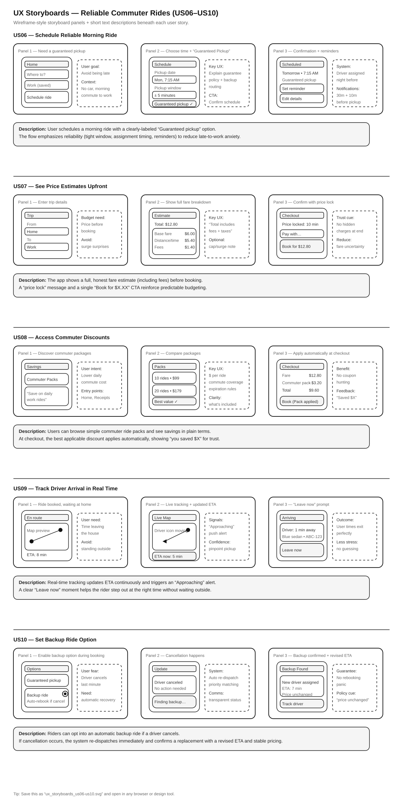
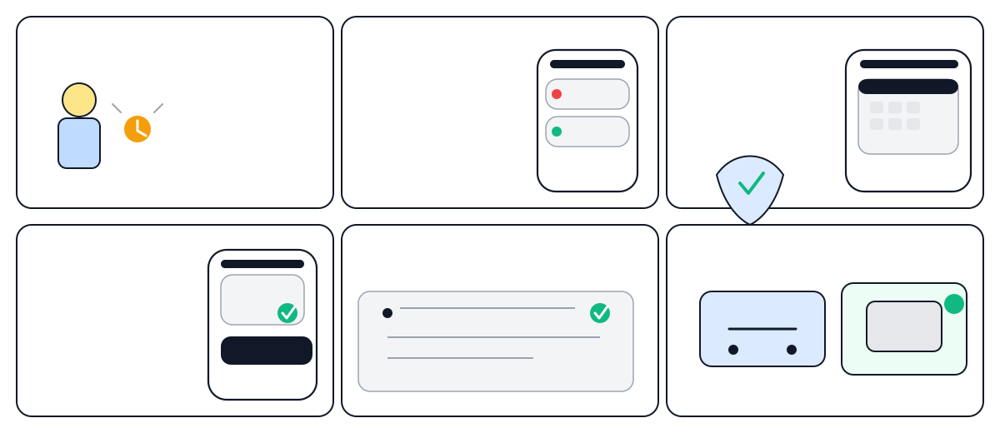

## As a person without a car who needs to get to work ...

**US06 – Schedule Reliable Morning Ride**

As a person without a car who needs to get to work, I want to schedule a guaranteed morning pickup so that I am not late to work.

**US07 – See Price Estimates Upfront**

As a person without a car who needs to get to work, I want to see the full fare estimate before booking so that I can budget my expenses.

**US08 – Access Commuter Discounts**

As a person without a car who needs to get to work, I want access to commuter ride packages so that daily travel is more affordable.

**US09 – Track Driver Arrival in Real Time**

As a person without a car who needs to get to work, I want real-time driver tracking so that I can plan when to leave my house.

**US10 – Set Backup Ride Option**

As a person without a car who needs to get to work, I want an automatic backup ride option if a driver cancels so that I still arrive on time.

First wireframe attempt:

Second wireframe attempt:

