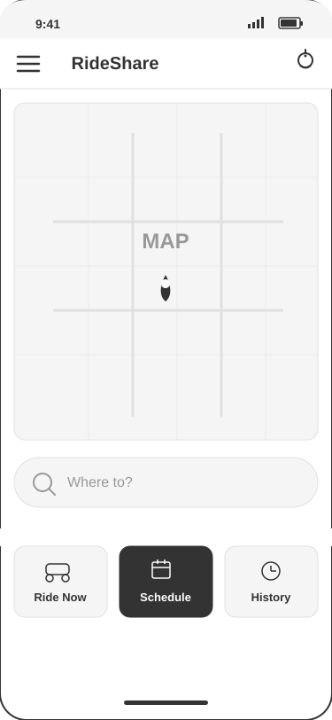
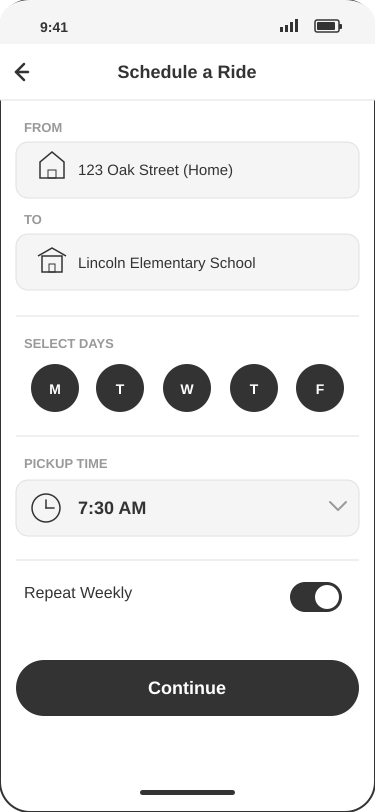
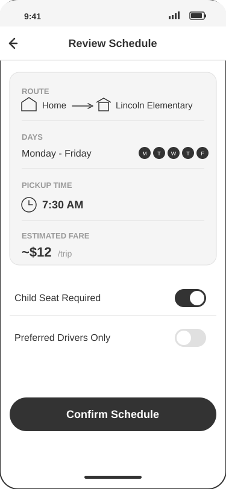
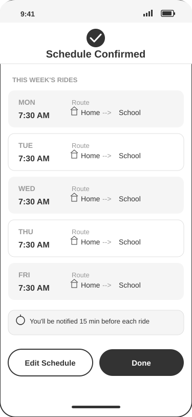

# Storyboard: Schedule School Pickup

**User Story:** As a single mom who is trying to get transport of kids, I want to schedule recurring rides for school pickup and drop-off so that my children arrive safely and on time.

**Persona:** Maria, 34, single working mom of two (ages 6 and 9). Works 9-5 and can't always leave to pick up kids from school.
**Scenario:** It's Sunday evening. Maria wants to set up the weekly school rides so she doesn't have to book manually every day.

---

## Panel 1: Opening the App

**Context:** It's Sunday at 8 PM. Maria is sitting on the couch after putting the kids to bed. She remembers she needs to arrange school transportation for the upcoming week. She opens the RideShare app on her phone.

**Action:** Maria taps the app icon and lands on the home screen. She sees a map centered on her current location, a "Where to?" search bar, and a row of action buttons at the bottom. She taps the "Schedule" button to begin setting up a recurring ride.

**System Response:** The home screen loads with Maria's saved home location pinned on the map. The bottom navigation displays three options: "Ride Now," "Schedule," and "History." When Maria taps "Schedule," the button highlights to indicate selection and the app transitions to the scheduling form.

**Emotion:** Maria feels a sense of purpose and mild urgency. She's relieved the app has a dedicated scheduling feature so she won't have to remember to book a ride every single morning.

---

## Panel 2: Entering Pickup and Drop-off Details

**Context:** Maria is now on the "Schedule a Ride" screen. She needs to enter the route details and select which days of the week the ride should repeat.

**Action:** Maria enters her home address ("123 Oak Street") in the "From" field and her children's school ("Lincoln Elementary School") in the "To" field. She then selects Monday through Friday on the day-of-week selector, sets the pickup time to 7:30 AM using the time picker, and ensures the "Repeat Weekly" toggle is switched on.

**System Response:** The app auto-completes her home address from saved locations. The school address is suggested after typing the first few letters based on previous rides. The day-of-week selector shows M T W T F as tappable circles that fill in when selected. The time picker scrolls to 7:30 AM. The "Repeat Weekly" toggle slides to the ON position with a visual color change. A "Continue" button becomes active at the bottom.

**Emotion:** Maria feels in control and efficient. The auto-complete and saved addresses save her time, reinforcing her trust in the app. Selecting all five weekdays at once feels much better than booking five separate rides.

---

## Panel 3: Reviewing and Confirming the Schedule

**Context:** Maria has filled in all the ride details and tapped "Continue." She is now on the review screen where she can verify everything before confirming.

**Action:** Maria reviews the summary card showing the route (Home to School), the selected days (Mon-Fri), the pickup time (7:30 AM), and the estimated fare (~$12 per trip). She toggles on "Child Seat Required" since her 6-year-old needs one. She leaves "Preferred Drivers Only" toggled off to maximize driver availability. Satisfied that everything looks correct, she taps the "Confirm Schedule" button.

**System Response:** The review screen presents all details in a clean summary card. The estimated fare is calculated based on the route distance. Toggle switches for "Child Seat Required" and "Preferred Drivers Only" allow quick preference adjustments. When Maria taps "Confirm Schedule," the app processes the request and transitions to the confirmation screen.

**Emotion:** Maria feels reassured by the clear summary. Seeing the estimated cost per trip helps her budget for the week. The child seat option gives her confidence that her children's safety is prioritized. She taps confirm with a feeling of accomplishment.

---

## Panel 4: Schedule Confirmed

**Context:** The schedule has been submitted and confirmed. Maria can now see the full week's rides laid out in a calendar view.

**Action:** Maria views the confirmation screen showing a checkmark and "Schedule Confirmed" message. Below it, a weekly calendar displays each day from Monday through Friday with the ride details: "7:30 AM -- Home to School." She reads the notification note confirming she'll be alerted 15 minutes before each ride. She taps "Done" to return to the home screen.

**System Response:** The app displays a confirmation header with a checkmark icon. A weekly calendar view lists all five scheduled rides with their times and routes. A note below the calendar informs Maria that push notifications will be sent 15 minutes before each pickup. Two buttons appear at the bottom: "Edit Schedule" in case she needs to make changes, and "Done" to return to the home screen.

**Emotion:** Maria feels deeply relieved and satisfied. The visual confirmation of the entire week's rides gives her peace of mind. She knows her kids will get to school safely and on time without her having to think about it every morning. She can now focus on her work week with one less thing to worry about.

