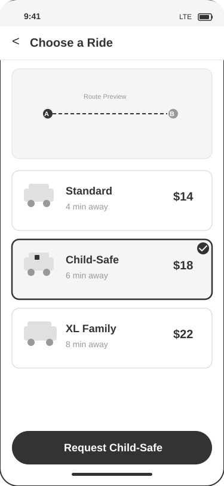
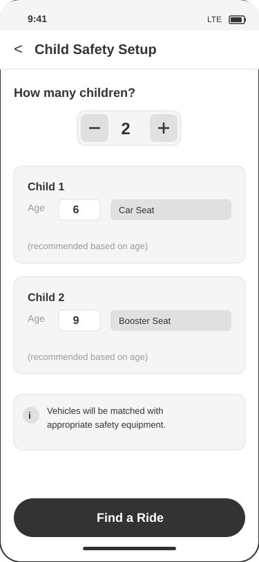
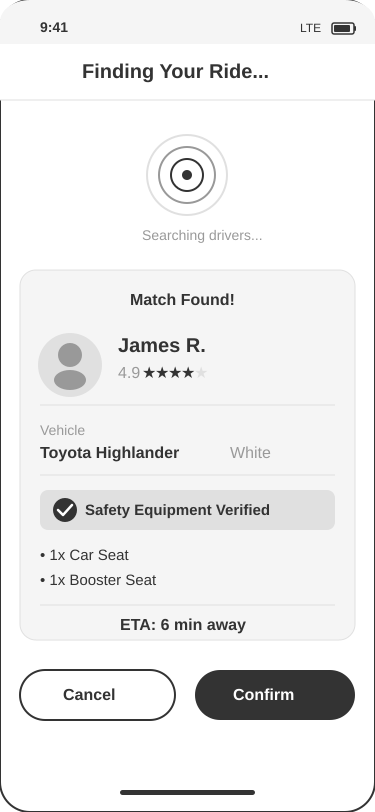
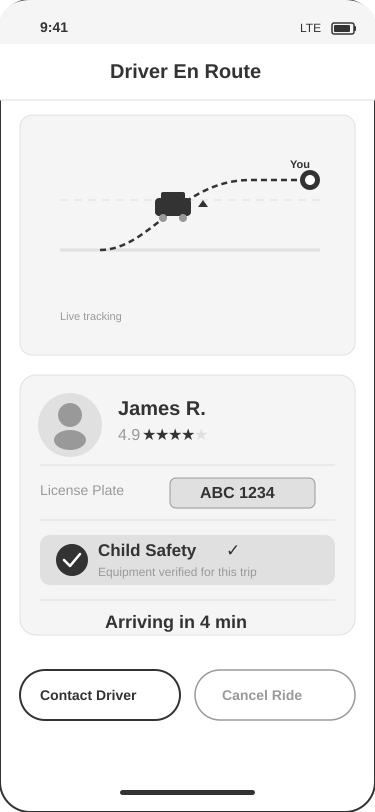

# Storyboard: Request Child-Safe Vehicle

**User Story:** As a single mom who is trying to get transport of kids, I want to request a vehicle with car seats so that my young children are safe and compliant with the law.

**Persona:** Maria, 34, single working mom of two (ages 6 and 9). Safety is her top priority.
**Scenario:** Maria needs to take her kids across town for a dentist appointment. She needs a vehicle equipped with appropriate car seats.

---

## Panel 1: Selecting the Child-Safe Ride Option
**Context:** Maria opens the app at home, already running a few minutes behind schedule. She has entered the dentist office as her destination and is now presented with a list of available ride categories.
**Action:** Maria scrolls through the ride options and taps the "Child-Safe" ride category, which is specifically designed for passengers traveling with young children.
**System Response:** The app highlights the Child-Safe option with a visible border, displaying the estimated arrival time (6 min) and fare ($18). A brief description notes that Child-Safe vehicles come equipped with verified child safety seats.
**Emotion:** Maria feels relieved that there is a dedicated option for kids. She does not have to call ahead or hope for the best — the app treats child safety as a first-class feature.

---

## Panel 2: Configuring Child Safety Requirements
**Context:** After selecting the Child-Safe category, Maria is taken to a configuration screen where she can specify the details about her children so the app can match the right safety equipment.
**Action:** Maria enters "2" for the number of children, then provides their ages: 6 and 9. The app automatically recommends the appropriate seat types based on each child's age.
**System Response:** The system displays "Car Seat (recommended)" for her 6-year-old and "Booster Seat (recommended)" for her 9-year-old. An informational banner confirms that vehicles will be matched with the appropriate safety equipment.
**Emotion:** Maria feels confident that the app understands the legal and safety requirements for each age group. She does not have to research seat guidelines herself — the app handles it automatically.

---

## Panel 3: Matching with a Verified Driver
**Context:** Maria has confirmed her children's details and tapped "Find a Ride." The app is now searching for nearby drivers whose vehicles are equipped with the exact safety seats she needs.
**Action:** Maria watches a brief matching animation while the system searches. Within seconds, a driver match appears: James R., rated 4.9 stars, driving a white Toyota Highlander with verified safety equipment.
**System Response:** The app displays the driver's profile photo, name, rating, vehicle details, and a clear confirmation: "Safety Equipment Verified" with "1x Car Seat + 1x Booster Seat." The estimated arrival time is 6 minutes.
**Emotion:** Maria feels reassured seeing the specific equipment listed and verified. Knowing the driver and vehicle details upfront gives her a sense of control and trust in the service.

---

## Panel 4: Driver Arrives with Verified Safety Equipment
**Context:** Maria has confirmed the ride and is now waiting with her two children at their pickup location. The app shows the driver en route on a live map.
**Action:** Maria monitors the driver's approach on the map. The app displays the driver's information, license plate number, and a prominent "Child Safety" verified badge, making it easy to identify the correct vehicle when it arrives.
**System Response:** The screen shows a live map with the driver's car icon approaching, an updated ETA of "Arriving in 4 min," the driver's details including license plate "ABC 1234," and the verified Child Safety badge. Contact and cancellation options are available at the bottom.
**Emotion:** Maria feels calm and prepared. The verified safety badge and complete driver details give her peace of mind that her children will be properly secured for the ride. She can focus on getting the kids ready rather than worrying about car seat logistics.

